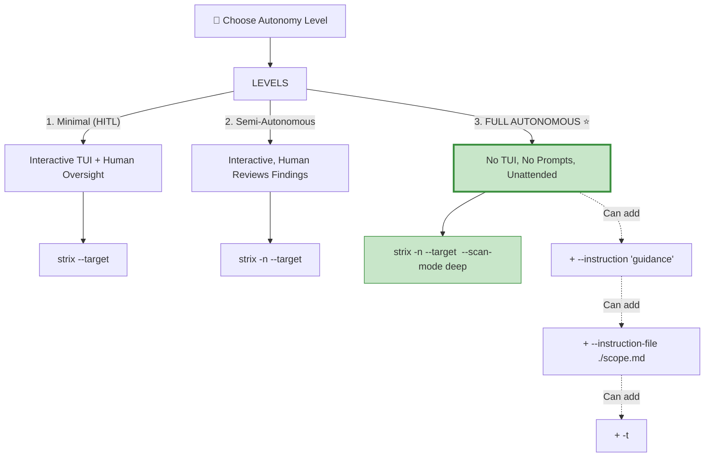
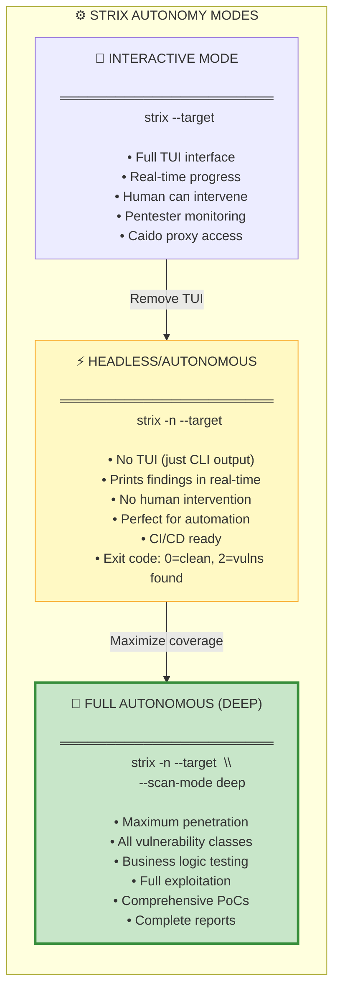
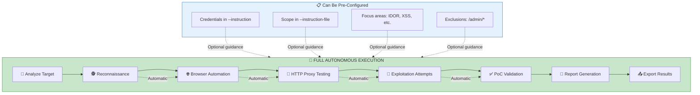

# Full Autonomous Mode in Strix

---

## TL;DR: Strix IS Already Fully Autonomous! 🎯

There is **no separate "yolo mode" or "autonomous mode" flag**. Strix is designed from the ground up to be an **autonomous AI pentester**. What you're looking for is achieved by combining flags.

---

## The "Full Autonomous" Command

```bash
# This IS full autonomous mode:
strix -n --target https://target.com --scan-mode deep
```

| Flag | Purpose |
|------|---------|
| `-n` | Non-interactive (no TUI, no prompts) |
| `--scan-mode deep` | Maximum coverage, thorough testing |
| `--target` | Your target |

<p align="center">
  
  <br/>
  <em>Launching Strix in autonomous mode from Windsurf IDE on DGX Spark — reconnaissance begins immediately after invocation with no human interaction required</em>
</p>

---

## Autonomy Levels



---

## Autonomous Modes Comparison



---

## Complete Autonomous Commands

### Level 1: Semi-Autonomous (CI/CD Ready)
```bash
strix -n --target https://target.com --scan-mode quick
```
**Use:** PR checks, fast feedback

### Level 2: Autonomous (Standard)
```bash
strix -n --target https://target.com --scan-mode standard
```
**Use:** Regular pentests, staging testing

### Level 3: FULL AUTONOMOUS (Recommended for Unattended) ⭐
```bash
strix -n --target https://target.com --scan-mode deep
```
**Use:** Comprehensive security review, bug bounty, unattended scanning

### Level 4: Full Autonomous + Multi-Target
```bash
strix -n \
  --target ./ \
  --target https://staging.target.com \
  --scan-mode deep \
  --instruction-file ./scope.md
```
**Use:** Full white-box + black-box combined testing

---

## Environment Variables for Maximum Autonomy

```bash
# Core config (required)
export STRIX_LLM="openai/gpt-5.4"
export LLM_API_KEY="sk-..."

# Performance tuning
export STRIX_REASONING_EFFORT="high"      # Thorough analysis
export STRIX_SANDBOX_EXECUTION_TIMEOUT=120 # Tool timeout (seconds)
export LLM_TIMEOUT=300                     # LLM timeout (seconds)

# Optional: Add OSINT capabilities
export PERPLEXITY_API_KEY="pplx-..."

# Run!
strix -n --target https://target.com --scan-mode deep
```

---

## What "Full Autonomous" Means in Strix



---

## Exit Codes (Automation-Friendly)

| Exit Code | Meaning | When Used |
|-----------|---------|-----------|
| `0` | ✅ No vulnerabilities found | Clean scan |
| `2` | ⚠️ Vulnerabilities found | Headless mode (`-n`) |
| `1` | ❌ Error/Interrupted | Any mode |

```bash
# Example automation script
#!/bin/bash
strix -n --target https://target.com --scan-mode deep

if [ $? -eq 2 ]; then
    echo "⚠️ Vulnerabilities found! Check strix_runs/"
    # Send alert, create ticket, etc.
else
    echo "✅ No vulnerabilities found"
fi
```

---

## Quick Reference: "YOLO" Command

```bash
# The equivalent of "full yolo mode" - just run and forget:
strix -n \
  --target https://target.com \
  --scan-mode deep \
  --instruction "Test everything. Full exploitation. Maximum severity focus."
```

---

## Summary

**There is NO separate "autonomous mode" flag** - Strix is designed to be autonomous by default. The `-n` flag simply removes the TUI for headless operation:

| Mode | Command | Human Needed? |
|------|---------|---------------|
| Interactive | `strix --target <t>` | Yes (monitoring) |
| Headless | `strix -n --target <t>` | Optional |
| **Full Autonomous** | `strix -n --target <t> --scan-mode deep` | **No** ⭐ |

**Recommendation for your pentesters:** Use `strix -n --target <target> --scan-mode deep` for unattended, fully autonomous scanning.