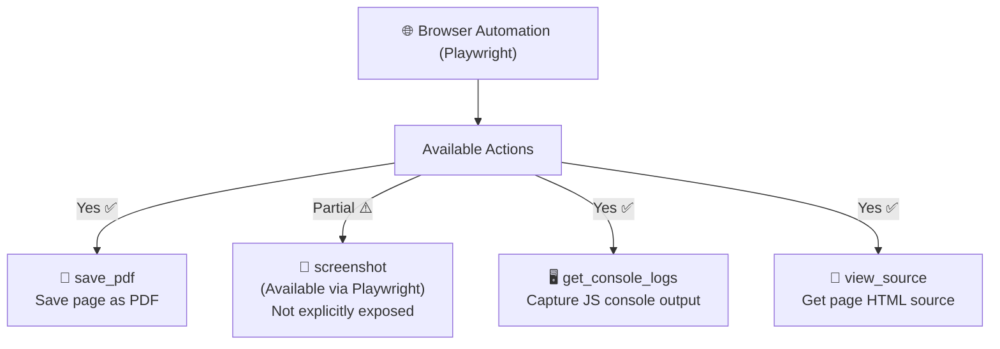

# Strix Screenshots Capability

---

## Current Screenshot Support



---

## Screenshot Capabilities by Component

| Component | Screenshot Support | Method |
|-----------|-------------------|--------|
| **Main Strix CLI** | ⚠️ Limited | Not explicitly exposed as tool |
| **Playwright Browser** | ✅ Full | Native Playwright support |
| **Caido Proxy** | ⚠️ Via UI | Manual capture in Caido Desktop |
| **MCP Server** | ✅ Available | `browser_screenshot` tool |

---

## What Strix DOES Capture

### 1. Browser PDF Exports
```python
# Available action in browser_actions.py
browser_action(
    action="save_pdf",
    file_path="/workspace/screenshot.pdf",
    tab_id="tab_123"
)
```

### 2. Page Source (HTML)
```python
# Get full page HTML
browser_action(
    action="view_source",
    tab_id="tab_123"
)
```

### 3. Console Logs (JavaScript)
```python
# Capture browser console
browser_action(
    action="get_console_logs",
    clear=False,  # Don't clear after reading
    tab_id="tab_123"
)
```

### 4. HTTP Traffic (via Caido)
```
- All HTTP/HTTPS requests captured
- Request/Response bodies stored
- Can be replayed and modified
- Accessible via Caido Desktop UI
```

---

## What Strix Does NOT Capture (Explicitly)

| Type | Status | Workaround |
|------|--------|------------|
| Visual Screenshots (.png/.jpg) | ❌ Not exposed | Use `save_pdf` or manual Caido |
| Full-page screenshots | ❌ Not exposed | Use `save_pdf` |
| Element-specific screenshots | ❌ Not exposed | Manual via Caido |

---

## Recommendations for Your Pentesters

### For Evidence Collection, Use:

```bash
# 1. Use Caido Desktop for visual inspection
#    - Strix exposes Caido proxy URL
#    - Manually capture screenshots in Caido UI

# 2. Save pages as PDF
browser_action(action="save_pdf", file_path="/workspace/evidence.pdf")

# 3. Capture console logs
browser_action(action="get_console_logs")

# 4. Export HTTP traffic
#    Use Caido Desktop to export request/response pairs
```

---

## Adding Screenshots to Your Instructions

You can instruct Strix to save evidence:

```markdown
# Add to your --instruction file:

## Evidence Collection Requirements

For each vulnerability found:

1. **Save PDF of vulnerable page**
   Use: browser_action(action="save_pdf", file_path="/workspace/evidence/vuln_001.pdf")

2. **Capture console logs**
   Use: browser_action(action="get_console_logs")

3. **Export HTTP request/response**
   Use Caido Desktop to export

4. **Save page source**
   Use: browser_action(action="view_source")

5. **Document in finding**
   Include file paths in vulnerability report
```

---

## TL;DR

| Question | Answer |
|----------|--------|
| **Does Strix take screenshots?** | ⚠️ **Limited** |
| **Visual PNG/JPG screenshots?** | ❌ Not natively exposed |
| **PDF exports?** | ✅ Yes (`save_pdf`) |
| **HTML source capture?** | ✅ Yes (`view_source`) |
| **Console logs?** | ✅ Yes (`get_console_logs`) |
| **HTTP traffic (via Caido)?** | ✅ Yes - full capture |
| **Manual screenshots?** | ✅ Via Caido Desktop UI |

**For formal pentest reports requiring visual evidence**, your pentesters should:
1. Use the Caido Desktop proxy for visual inspection
2. Export screenshots manually from Caido
3. Use `save_pdf` for page evidence
4. Include HTTP traffic captures as supplementary evidence