# Strix Human-in-the-Loop (HITL) Diagrams

## Complete HITL Architecture

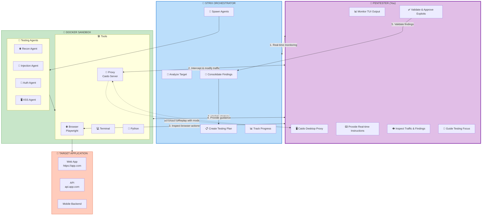

---

<p align="center">
  
  <br/>
  <em>Strix TUI during a live pentest — the agent sidebar (right) shows all specialized agents and their status, while the main panel displays the executive summary with findings, exploitation results, and recommendations</em>
</p>

---

## HITL Collaboration Workflow

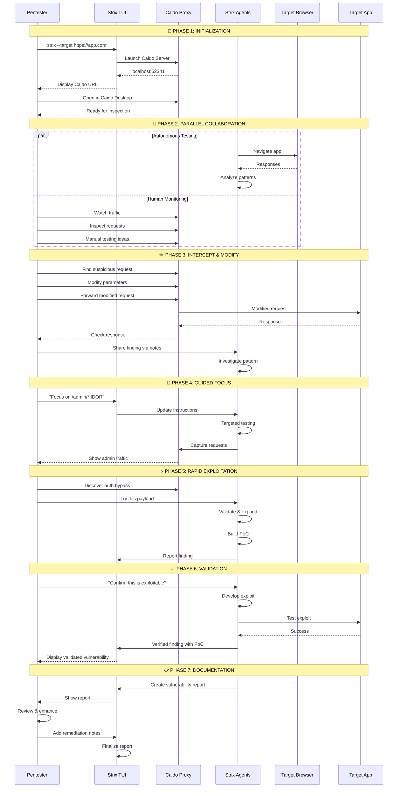

---

## Interactive Control Points

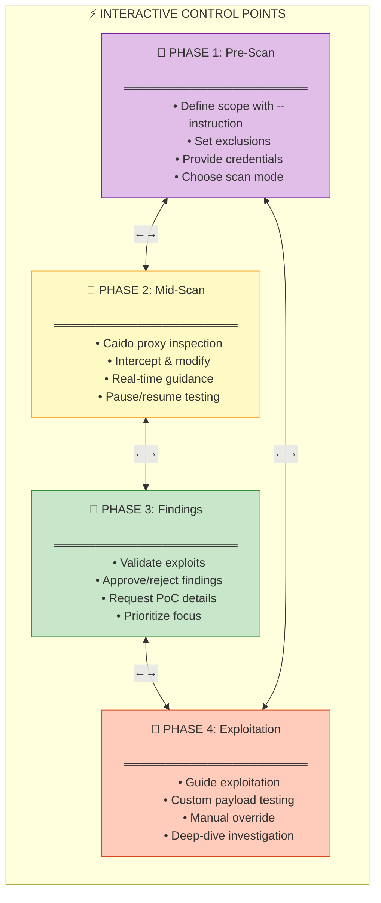

---

## Caido Proxy Integration

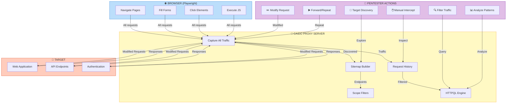

---

## Real-Time Collaboration Session

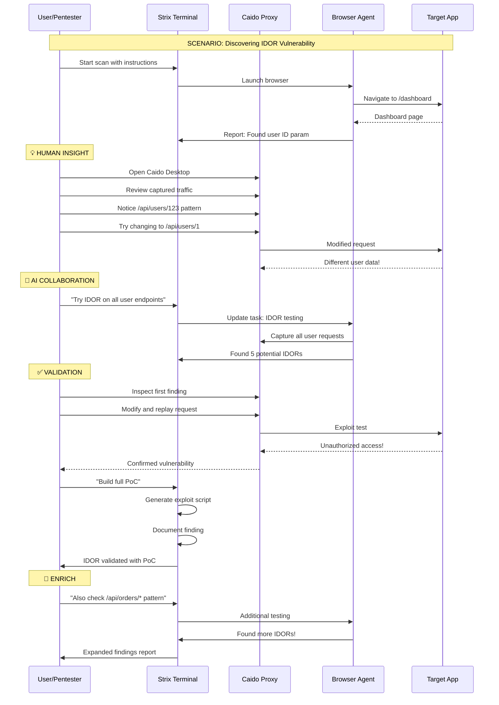

---

## HITL Decision Tree

```mermaid
flowchart TD
    START([🔍 New Finding Detected]) --> REVIEW{"👤 Review Finding?"}
    
    REVIEW -->|Yes - Low Priority| LOW[📝 Log Finding]
    LOW --> CONTINUE[➡️ Continue Testing]
    
    REVIEW -->|Yes - High Priority| HIGH[🎯 Investigate Deep]
    HIGH --> EXPLOIT{"⚡ Exploit Possible?"}
    
    EXPLOIT -->|Yes - Automated| AUTO[🤖 Let Strix Exploit]
    AUTO --> VALIDATE{✅ Validate?"}
    VALIDATE -->|Yes| POCC[📸 Generate Full PoC]
    VALIDATE -->|No - Need Manual| MANUAL[👤 Manual Testing]
    MANUAL --> POCC
    
    EXPLOIT -->|Requires Creativity| MANUAL2[👤 Custom Exploit]
    MANUAL2 --> POCC
    
    REVIEW -->|Not Valid| FALSEPOS[❌ Mark False Positive]
    FALSEPOS --> CONTINUE
    
    POCC --> REPORT[📄 Document Finding]
    REPORT --> SEVERITY{⚠️ Severity?"}
    
    SEVERITY -->|Critical| ESCALATE[🚨 Escalate Immediately]
    ESCALATE --> DONE
    
    SEVERITY -->|High| HIGHRISK[⚠️ Add to Report]
    HIGHRISK --> DONE
    
    SEVERITY -->|Medium/Low| LOWREPORT[📋 Standard Report]
    LOWREPORT --> DONE
    
    CONTINUE -->|Loop| START
    DONE([✅ Next Finding])
    
    classDef review fill:#e1bee7,stroke:#7b1fa2
    classDef decision fill:#fff9c4,stroke:#f9a825
    classDef action fill:#c8e6c9,stroke:#388e3c
    classDef alert fill:#ffcdd2,stroke:#d84315

    class START,REVIEW,EXPLOIT,VALIDATE,SEVERITY decision
    class LOW,HIGH,AUTO,MANUAL,MANUAL2,POCC,REPORT,HIGHRISK,LOWREPORT action
    class ESCALATE,FALSEPOS alert
    class DONE review
```

---

## Caido Workflow for Manual Testing

```mermaid
flowchart TB
    subgraph DISCOVER["🔍 DISCOVERY PHASE"]
        D1[Launch Strix] --> D2[Caido URL appears]
        D2 --> D3[Open Caido Desktop]
        D3 --> D4[Browse target app]
        D4 --> D5[Traffic captured automatically]
        D5 --> D6[Review sitemap]
    end

    subgraph ANALYZE["📊 ANALYSIS PHASE"]
        D6 --> A1[Filter by scope]
        A1 --> A2[Look for interesting endpoints]
        A2 --> A3[/api/*, /admin/*, /user/*]
        A3 --> A4[Check request parameters]
        A4 --> A5[Look for IDs, tokens, data]
    end

    subgraph TEST["⚡ TESTING PHASE"]
        A5 --> T1[Select request]
        T1 --> T2[Modify parameters]
        T2 --> T3[Add payloads]
        T3 --> T4[Forward request]
        T4 --> T5[Analyze response]
    end

    subgraph VALIDATE["✅ VALIDATION PHASE"]
        T5 --> V1{"Vulnerable?"}
        V1 -->|Yes| V2[Repeat with variations]
        V2 --> V3[Confirm exploitability]
        V3 --> V4[Share with Strix agent]
        V4 --> V5[Request PoC generation]
        
        V1 -->|No| V6[Log & continue]
        V6 --> BACK[🔙 Back to analysis]
    end

    subgraph ENRICH["📝 ENRICHMENT PHASE"]
        V5 --> E1[Strix validates finding]
        E1 --> E2[Generate documentation]
        E2 --> E3[Create exploit script]
        E3 --> E4[Add to report]
    end

    BACK -.-> ANALYZE

    classDef discover fill:#e3f2fd,stroke:#1976d2
    classDef analyze fill:#fff9c4,stroke:#f9a825
    classDef test fill:#c8e6c9,stroke:#388e3c
    classDef validate fill:#e1bee7,stroke:#7b1fa2
    classDef enrich fill:#ffccbc,stroke:#d84315

    class DISCOVER discover
    class ANALYZE analyze
    class TEST test
    class VALIDATE validate
    class ENRICH enrich
```

---

## Feedback Loop System

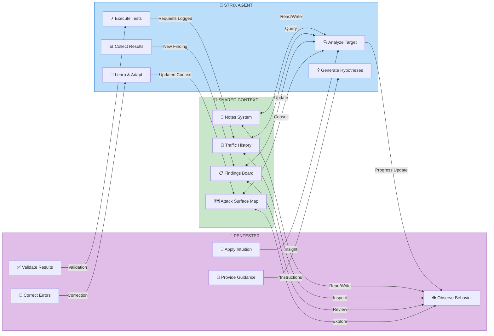

---

## Common HITL Scenarios

```mermaid
flowchart TD
    START([🎯 Choose Scenario]) --> SCENARIOS
    
    SCENARIOS -->|"1. I found something!"| SCEN1
    SCENARIOS -->|"2. Where do I look?"| SCEN2
    SCENARIOS -->|"3. Strix is stuck"| SCEN3
    SCENARIOS -->|"4. Validate this finding"| SCEN4
    SCENARIOS -->|"5. Customize the scan"| SCEN5

    subgraph SCEN1["🔍 Scenario 1: Manual Discovery"]
        S1A[Use Caido to intercept] --> S1B[Modify request]
        S1B --> S1C[Forward to target]
        S1C --> S1D[Confirmed exploitable?]
        S1D -->|Yes| S1E[Share with Strix via notes]
        S1D -->|No| S1F[Log observation]
        S1E --> S1G[Strix builds PoC & documents]
    end

    subgraph SCEN2["🎯 Scenario 2: Guidance Needed"]
        S2A[Open Caido sitemap] --> S2B[Review discovered endpoints]
        S2B --> S2C[Identify interesting paths]
        S2C --> S2D[/admin/, /api/users/, /upload/]
        S2D --> S2E[Send guidance to Strix]
        S2E --> S2F["Focus on IDOR in /api/users/*"]
    end

    subgraph SCEN3["🔄 Scenario 3: Agent Stuck"]
        S3A[Check current agent status] --> S3B[Identify blockage point]
        S3B --> S3C[Provide workaround]
        S3C --> S3D["Try alternative payload X"]
        S3D --> S3E[Resume agent]
        S3E --> S3F[Monitor progress]
    end

    subgraph SCEN4["✅ Scenario 4: Finding Validation"]
        S4A[Review finding in TUI] --> S4B[Open Caido traffic]
        S4B --> S4C[Replay the request]
        S4C --> S4D[Confirm vulnerability]
        S4D --> S4E["Impact: Can read any user's data"]
        S4E --> S4F[Add remediation notes]
        S4F --> S4G[Approve for report]
    end

    subgraph SCEN5["⚙️ Scenario 5: Customize Scan"]
        S5A[Create instruction file] --> S5B[Specify focus areas]
        S5B --> S5C["XSS in comment fields"]
        S5C --> S5D[Set exclusions]
        S5D --> S5E["Skip /admin area"]
        S5E --> S5F[Provide test credentials]
        S5F --> S5G[Run targeted scan]
    end

    SCEN1 --> END([📋 Continue Testing])
    SCEN2 --> END
    SCEN3 --> END
    SCEN4 --> END
    SCEN5 --> END

    style SCEN1 fill:#c8e6c9,stroke:#388e3c
    style SCEN2 fill:#bbdefb,stroke:#1976d2
    style SCEN3 fill:#fff9c4,stroke:#f9a825
    style SCEN4 fill:#e1bee7,stroke:#7b1fa2
    style SCEN5 fill:#ffccbc,stroke:#d84315
```

---

## Interactive Notes System

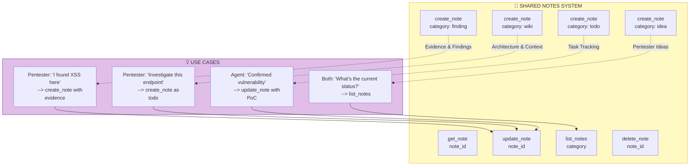

---

## Real-World Testing Scenario

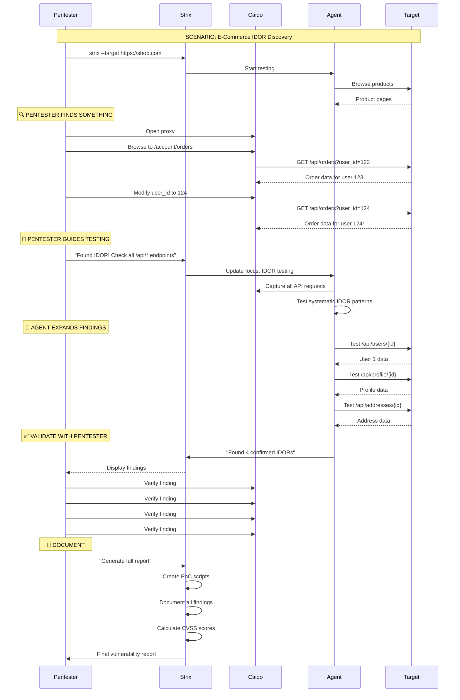

---

## HITL Best Practices Checklist

```mermaid
flowchart TB
    subgraph PREP["✅ PRE-SCAN CHECKLIST"]
        PC1[☐ Define scope clearly]
        PC2[☐ Prepare instruction file]
        PC3[☐ Set up Caido Desktop access]
        PC4[☐ Have test accounts ready]
        PC5[☐ Choose appropriate scan mode]
    end

    subgraph MONITOR["✅ MONITORING CHECKLIST"]
        MC1[☐ Watch TUI for discoveries]
        MC2[☐ Review Caido traffic regularly]
        MC3[☐ Check sitemap for coverage]
        MC4[☐ Note interesting patterns]
        MC5[☐ Track agent progress]
    end

    subgraph INTERACT["✅ INTERACTION CHECKLIST"]
        IC1[☐ Provide guidance on discoveries]
        IC2[☐ Correct agent when needed]
        IC3[☐ Request specific tests]
        IC4[☐ Validate high-priority findings]
        IC5[☐ Use notes to share context]
    end

    subgraph VALIDATE["✅ VALIDATION CHECKLIST"]
        VC1[☐ Manually verify exploits]
        VC2[☐ Check false positives]
        VC3[☐ Assess actual impact]
        VC4[☐ Confirm PoC works]
        VC5[☐ Document remediation steps]
    end

    subgraph REPORT["✅ REPORTING CHECKLIST"]
        RC1[☐ Review all findings]
        RC2[☐ Add human insights]
        RC3[☐ Enhance PoC descriptions]
        RC4[☐ Prioritize by risk]
        RC5[☐ Export final reports]
    end

    PREP --> MONITOR --> INTERACT --> VALIDATE --> REPORT

    style PREP fill:#e3f2fd,stroke:#1976d2
    style MONITOR fill:#fff9c4,stroke:#f9a825
    style INTERACT fill:#e1bee7,stroke:#7b1fa2
    style VALIDATE fill:#c8e6c9,stroke:#388e3c
    style REPORT fill:#ffccbc,stroke:#d84315
```

---

## Summary: When to Intervene

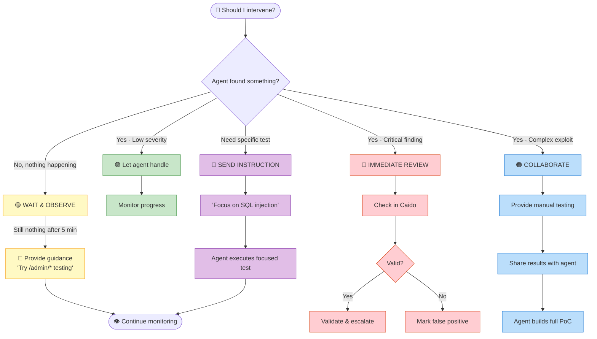

---

These diagrams illustrate how **you remain in control** while Strix handles the heavy lifting. The HITL approach combines:
- **Autonomous scanning** for speed and coverage
- **Human intuition** for complex vulnerabilities  
- **Caido proxy** for manual inspection and manipulation
- **Real-time collaboration** via notes and instructions
- **Validation** before final reporting