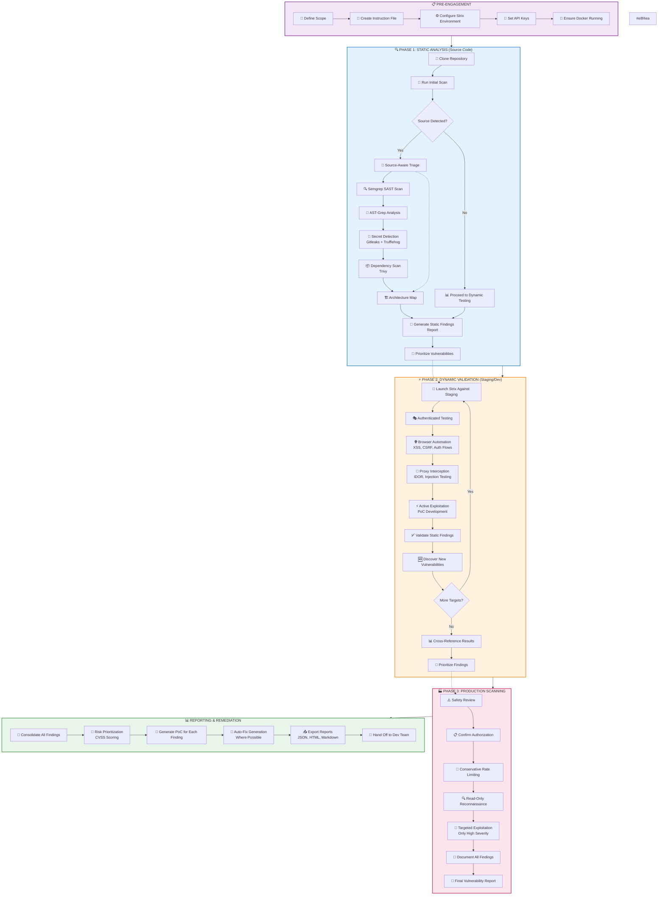
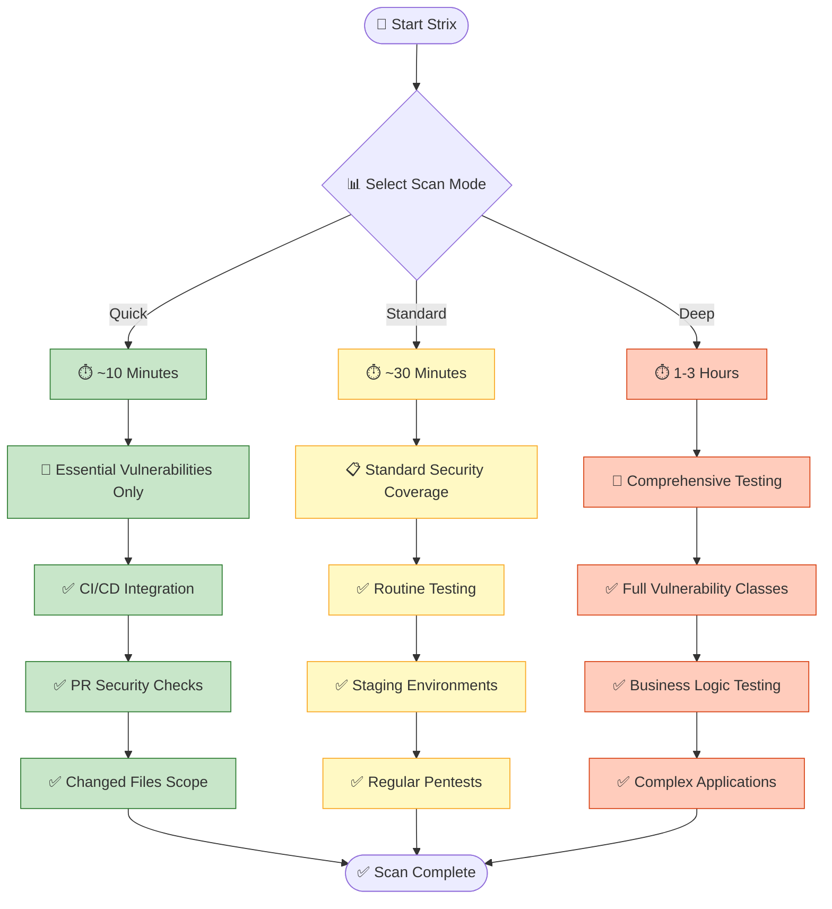
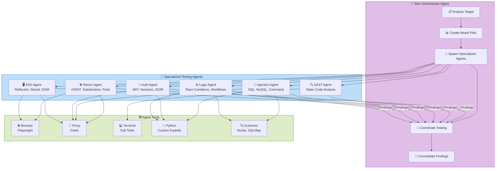
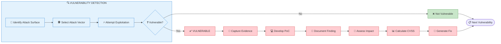
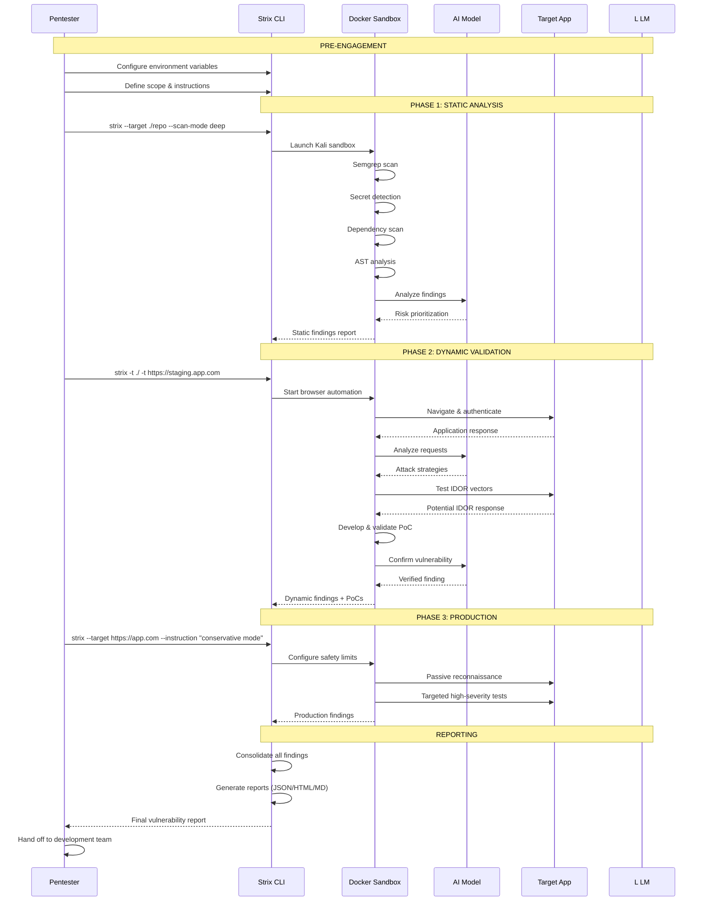
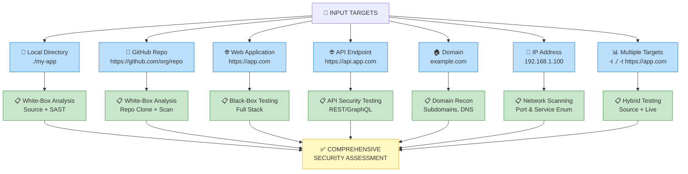
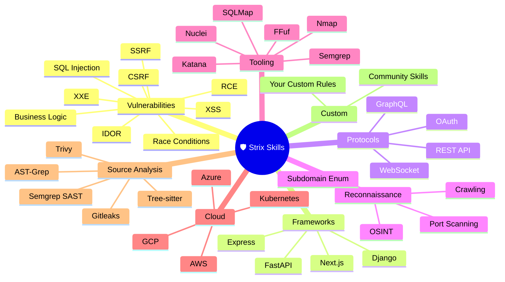

# Strix Pentesting Process - Mermaid.js Diagram

## Complete Pentesting Workflow

---

## Scan Modes Decision Flow

---

## Multi-Agent Architecture

---

## Vulnerability Testing Flow

---

## Complete Pentesting Pipeline

---

  
   
  <em>Strix penetration test completion — consolidated findings with remediation priorities and actionable next steps</em>

---

## Target Types & Input Methods

---

## Skills & Vulnerability Coverage

---

You can render these diagrams using any Markdown viewer that supports Mermaid (GitHub, GitLab, Notion, VS Code with Mermaid preview, etc.) or paste them into [mermaid.live](https://mermaid.live) for interactive viewing.