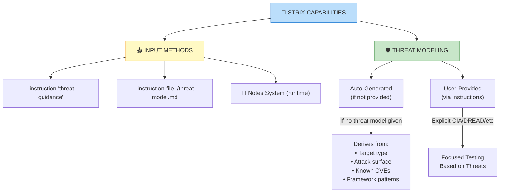
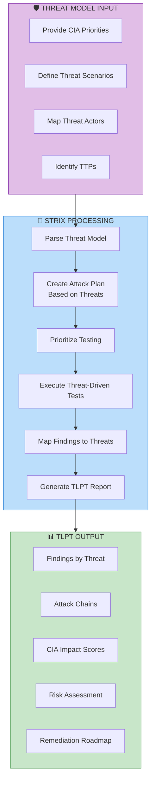

# Threat-Led Penetration Testing (TLPT) with Strix

---

## Current Strix Capabilities



---

## What Strix Supports

| Feature | Supported? | Method |
|---------|------------|--------|
| CIA Criteria | ✅ Yes | `--instruction` |
| DREAD Scoring | ✅ Yes | `--instruction-file` |
| STRIDE Analysis | ✅ Yes | `--instruction-file` |
| MITRE ATT&CK Mapping | ✅ Yes | `--instruction-file` |
| Threat Actor Profiles | ✅ Yes | `--instruction` |
| CVSS v3.1 | ✅ Built-in | Automatic |
| DREAD Scoring | ✅ Yes | Via instructions |
| Custom Threat Models | ✅ Yes | Via instruction file |
| Auto Threat Modeling | ⚠️ Partial | Implicit (no explicit output) |

---

## TLPT Instruction Template

```markdown
# =============================================================================
# THREAT-LED PENETRATION TESTING (TLPT) INSTRUCTIONS
# =============================================================================
# This instruction file configures Strix for Threat-Led Penetration Testing
# where security testing is driven by threat intelligence and risk prioritization.
# =============================================================================

## ENGAGEMENT TYPE

**Threat-Led Penetration Testing (TLPT)**

Testing approach MUST be driven by:
1. Threat Model / Threat Intelligence
2. CIA Prioritization (Confidentiality, Integrity, Availability)
3. Identified Threat Actors / TTPs
4. Risk-Based Prioritization

---

## THREAT MODEL

### Business Context
[Brief description of the organization's mission, assets, and business impact]

### CIA Triad Priorities
Rank the importance (Critical > High > Medium > Low):

**CONFIDENTIALITY** (Protect sensitive data from unauthorized disclosure)
- Critical Assets: [e.g., Customer PII, Financial records, Trade secrets]
- Priority Level: [CRITICAL/HIGH/MEDIUM/LOW]
- Attack Scenarios:
  1. Data breach via SQL injection
  2. Unauthorized access via IDOR
  3. Session hijacking leading to data exposure

**INTEGRITY** (Protect data from unauthorized modification)
- Critical Assets: [e.g., Transaction records, User data, Configuration]
- Priority Level: [CRITICAL/HIGH/MEDIUM/LOW]
- Attack Scenarios:
  1. Transaction manipulation via parameter tampering
  2. Privilege escalation to modify admin data
  3. Content injection (XSS) to modify displayed data

**AVAILABILITY** (Ensure systems remain operational)
- Critical Assets: [e.g., Core business services, API endpoints]
- Priority Level: [CRITICAL/HIGH/MEDIUM/LOW]
- Attack Scenarios:
  1. DoS affecting customer-facing services
  2. Resource exhaustion via infinite loops/queries
  3. Dependency on third-party services

### Threat Actors (Identified)
```
Threat Actor 1: [Name/Type]
- Motivation: [Financial, Espionage, Hacktivism, etc.]
- TTPs: [MITRE ATT&CK techniques they might use]
  • T1190 - Exploit Public-Facing Application
  • T1133 - External Remote Services
  • T1078 - Valid Accounts

Threat Actor 2: [Name/Type]
- Motivation: [...]
- TTPs: [...]
```

### Attack Surface
```
Public-Facing:
- Web Application: https://target.com
- API: https://api.target.com
- Mobile API: https://mobile-api.target.com

Internal (if in scope):
- VPN Gateway: vpn.target.com
- Internal Admin: internal-admin.target.com

Third-Party:
- Cloud Provider: AWS, Azure, GCP
- SaaS Integrations: [List]
```

---

## RISK-BASED TESTING PRIORITIES

### Tier 1: CRITICAL Priority (Test First)
Vulnerabilities that could lead to:
1. [e.g., Mass PII exfiltration]
2. [e.g., Complete authentication bypass]
3. [e.g., Remote Code Execution]

**Focus Attack Vectors:**
- SQL/NoSQL Injection → Data Breach (Confidentiality)
- Authentication Bypass → Unauthorized Access (Integrity)
- RCE → System Compromise (All CIA)

### Tier 2: HIGH Priority
Vulnerabilities that could lead to:
1. [e.g., Individual user data access]
2. [e.g., Privilege escalation]
3. [e.g., Business logic exploitation]

**Focus Attack Vectors:**
- IDOR → Horizontal/Vertical Privilege Escalation
- JWT Vulnerabilities → Session Hijacking
- Business Logic Flaws → Financial Impact

### Tier 3: MEDIUM Priority
Vulnerabilities that could lead to:
1. [e.g., Limited information disclosure]
2. [e.g., Self-XSS with limited impact]
3. [e.g., CSRF for limited actions]

### Tier 4: LOW/INFO Priority
- Informational findings
- Best practice violations
- Low-risk misconfigurations

---

## MITRE ATT&CK MAPPING

Test the following ATT&CK techniques based on identified threat actors:

### Initial Access
- T1190: Exploit Public-Facing Application
- T1133: External Remote Services
- T1078: Valid Accounts

### Execution
- T1059: Command and Scripting Interpreter
- T1106: Native API

### Persistence
- T1078: Valid Accounts
- T1505: Server Software Component

### Privilege Escalation
- T1068: Exploitation for Privilege Escalation
- T1078: Valid Accounts

### Defense Evasion
- T1070: Indicator Removal
- T1562: Impair Defenses

### Credential Access
- T1110: Brute Force
- T1552: Unsecured Credentials
- T1555: Credentials from Password Stores

### Discovery
- T1018: Remote System Discovery
- T1046: Network Service Scanning

### Lateral Movement
- T1210: Exploitation of Remote Services
- T1021: Remote Services

### Collection
- T1005: Data from Local System
- T1114: Email Collection

### Exfiltration
- T1041: Exfiltration Over C Channel

---

## TESTING SCENARIOS BY THREAT

### Scenario 1: Data Breach (Confidentiality Focus)
**Threat:** Threat Actor steals sensitive customer data

**Attack Chain:**
1. Exploit SQL Injection → Database access
2. Dump customer PII (names, emails, passwords)
3. Exfiltrate data

**Test These:**
- SQL/NoSQL Injection in all input points
- Error-based/Blind SQLi
- IDOR to access other users' data
- SSRF to access internal databases
- File inclusion to read sensitive files

**Evidence Required:**
- PoC demonstrating data extraction
- Data sensitivity classification

### Scenario 2: Account Takeover (Integrity Focus)
**Threat:** Threat Actor takes over user accounts

**Attack Chain:**
1. Credential stuffing / Brute force
2. Session hijacking
3. Authentication bypass

**Test These:**
- Authentication mechanisms
- Session management
- Password policies
- MFA bypasses
- JWT vulnerabilities

**Evidence Required:**
- Successful account takeover PoC
- Session token manipulation

### Scenario 3: Service Disruption (Availability Focus)
**Threat:** Threat Actor disrupts business operations

**Attack Chain:**
1. Exploit vulnerability
2. Cause resource exhaustion
3. Service becomes unavailable

**Test These:**
- DoS vulnerabilities
- Race conditions
- Logic bombs
- Resource consumption

**Evidence Required:**
- Demonstrated service impact
- Recovery time assessment

---

## REPORTING REQUIREMENTS

### TLPT-Specific Output
1. **Threat Mapping**
   - Each finding mapped to threat scenario
   - Attack chain visualization
   - Kill chain analysis

2. **Risk Scores**
   - CVSS v3.1 score
   - DREAD score (if required)
   - CIA impact assessment

3. **Business Impact**
   - Impact on confidentiality
   - Impact on integrity
   - Impact on availability
   - Remediation priority

4. **Threat Actor Alignment**
   - Findings mapped to relevant threat actors
   - TTPs observed/exploited
   - Recommended mitigations

---

## COMPLIANCE FRAMEWORK ALIGNMENT

Map findings to compliance requirements:

- [ ] NIST SP 800-53
- [ ] ISO 27001
- [ ] PCI DSS
- [ ] GDPR
- [ ] SOC 2
- [ ] [Other frameworks]

---

## EXECUTION PRIORITY

1. **Start** with Tier 1 (Critical) threats
2. **Document** each finding with threat alignment
3. **Validate** attack feasibility
4. **Assess** business impact
5. **Prioritize** remediation

---

## END OF THREAT MODEL

You have been provided with the threat model. Use this information to:

1. **Prioritize testing** based on threat severity
2. **Focus on attack vectors** relevant to identified threats
3. **Map findings** to threat scenarios
4. **Assess CIA impact** for each vulnerability
5. **Generate TLPT-specific reporting**

**Begin Threat-Led Penetration Testing.**
```

---

## CIA-Focused Quick Template

If you just need to provide CIA priorities quickly:

```markdown
# =============================================================================
# TLPT - CIA CRITERIA & THREAT PRIORITIES
# =============================================================================

## TESTING PRIORITY (Rank 1-3)

1. **[HIGHEST] CONFIDENTIALITY**
   - Focus: Data breach scenarios
   - Critical assets: [Customer PII, Financial data, Secrets]
   - Attack vectors to prioritize:
     • SQL Injection → Data exfiltration
     • IDOR → Unauthorized data access
     • SSRF → Internal data access
     • Secrets exposure → API keys, tokens

2. **[HIGH] INTEGRITY**
   - Focus: Data manipulation scenarios
   - Critical assets: [Transactions, User data, Configs]
   - Attack vectors to prioritize:
     • Parameter tampering → Modify prices, quantities
     • Privilege escalation → Admin access
     • Business logic flaws → Workflow bypass
     • Content injection → XSS to modify data

3. **[MEDIUM] AVAILABILITY**
   - Focus: Service disruption scenarios
   - Critical assets: [Core services, APIs]
   - Attack vectors to prioritize:
     • DoS conditions
     • Resource exhaustion
     • Logic bombs

## THREAT SCENARIOS TO TEST

### Scenario A: Customer Data Breach
1. Gain initial access via [web app]
2. Exploit SQLi to dump database
3. Extract PII

### Scenario B: Financial Manipulation  
1. Exploit IDOR in transactions
2. Modify payment amounts
3. Verify successful manipulation

### Scenario C: Service Outage
1. Identify DoS vector
2. Demonstrate impact
3. Measure recovery time

## REQUIRED EVIDENCE

For each finding, provide:
- CIA impact assessment
- Threat scenario alignment
- Business risk rating
- Remediation priority (1-30 days)
```

---

## TLPT Execution Command

```bash
# Execute Threat-Led Penetration Testing
strix -n \
    --target ./ \
    --target "$UAT_URL" \
    --scan-mode deep \
    --instruction-file ./tlpt-threat-model.md
```

---

## TLPT Process Flow



---

## Summary

| Your Requirement | Strix Support |
|------------------|---------------|
| CIA Criteria | ✅ Via `--instruction-file` |
| Threat Model Input | ✅ Via `--instruction-file` |
| DREAD/STRIDE | ✅ Via instructions |
| MITRE ATT&CK | ✅ Via instructions |
| TLPT Execution | ✅ Autonomous with threat guidance |
| Auto Threat Modeling | ⚠️ Implicit (not explicit) |

**Recommendation:** For formal TLPT engagements, always provide your threat model explicitly via `--instruction-file`. While Strix will auto-derive some threat context, formal engagements require documented threat intelligence driving the testing.