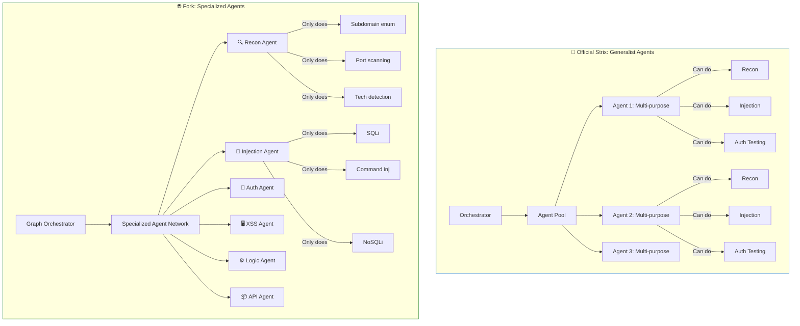
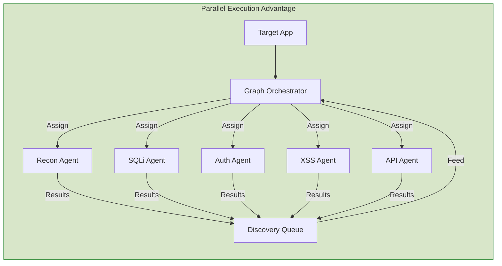
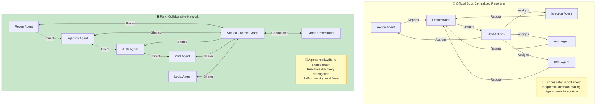
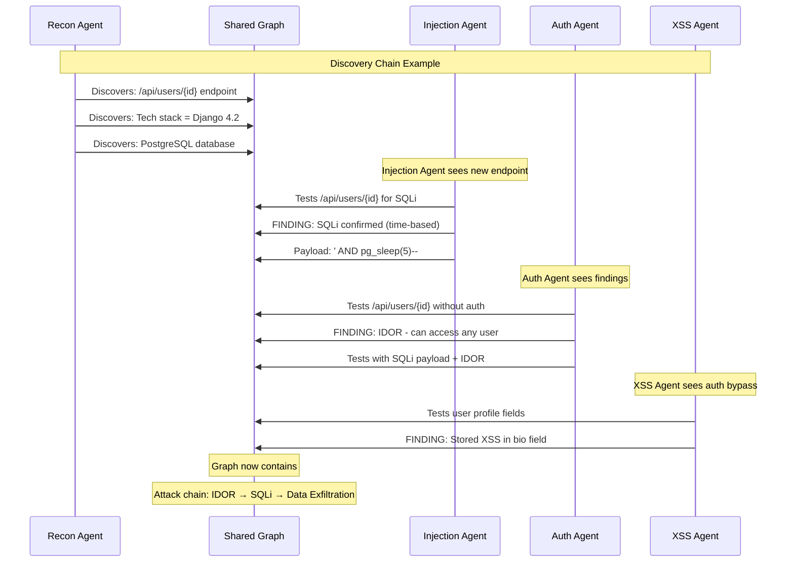

# Deep Dive: Multi-Agent Architecture Differences in Strix Forks

This document provides a detailed technical analysis of the two key architectural differentiators in the `provoiceservices/strix-pentest` fork compared to the official `usestrix/strix` implementation.

---

## 1. Specialized Agents Per Attack Type

### Overview

The official Strix uses a **generalist agent model** where agents are capable of multiple testing activities but follow a centralized orchestration pattern. The fork introduces **domain-specialized agents** that focus on specific attack vectors or asset types.

### Architecture Comparison



### Specialized Agent Types in Fork

| Agent Type | Focus Area | Specific Capabilities | Exclusions |
|------------|-----------|----------------------|------------|
| **🔍 Recon Agent** | Attack surface mapping | Subdomain enumeration, port scanning, tech fingerprinting, endpoint discovery | No exploitation |
| **💉 Injection Agent** | Input validation flaws | SQL injection, NoSQL injection, command injection, LDAP injection, XPath injection | No business logic testing |
| **🔐 Auth Agent** | Authentication/authorization | JWT analysis, session management, privilege escalation, IDOR, OAuth bypass | No infrastructure testing |
| **🖥️ XSS Agent** | Client-side attacks | Reflected XSS, stored XSS, DOM XSS, CSP bypass, prototype pollution | No server-side testing |
| **⚙️ Logic Agent** | Business logic flaws | Race conditions, workflow bypasses, price manipulation, state manipulation | No injection testing |
| **📦 API Agent** | API security | REST/GraphQL testing, parameter pollution, mass assignment, rate limiting | No UI-based testing |
| **🏗️ SAST Agent** | Static analysis | Semgrep, secret detection, dependency scanning, AST analysis | No dynamic testing |

### Specialized Agents in Action

The following screenshots show Strix's specialized agents executing targeted tests during a live penetration test:

<p align="center">
  
  <br/>
  <em>Login/Auth Validation Agent performing SQL injection testing — executing targeted payloads with curl, analyzing response patterns, and testing credential combinations</em>
</p>

<p align="center">
  
  <br/>
  <em>Login/Auth Validation Agent executing credential testing with Hydra — automated brute-force detection with CSRF token handling and HTTP response code analysis</em>
</p>

<p align="center">
  
  <br/>
  <em>XSS Validation Agent results — execution-driven payload testing across multiple injection points with reflected/stored status tracking</em>
</p>

<p align="center">
  
  <br/>
  <em>Admin Access Validation Agent auditing access controls — inspecting Flask route handlers, testing endpoint authorization, and mapping HTTP request/response patterns</em>
</p>

### Benefits of Specialization

#### 1. Deeper Expertise

**Official Strix (Generalist):**
```
Agent receives task: "Test for SQL injection"
→ Loads general pentesting context
→ Uses generic exploitation patterns
→ May miss framework-specific nuances
```

**Fork (Specialist):**
```
SQL Injection Agent receives task: "Test for SQL injection"
→ Loads SQLi-specific rule sets
→ Knows database-specific payloads (MySQL, PostgreSQL, MSSQL, Oracle)
→ Uses blind/time-based/boolean technique selection
→ Understands ORM-specific injection vectors
→ Applies WAF evasion techniques specific to SQLi
```

#### 2. Optimized Tool Selection

| Testing Scenario | Official Strix (General) | Fork (Specialized) |
|------------------|-------------------------|-------------------|
| SQLi detection | `sqlmap` with default options | `sqlmap` with technique-specific tuning, custom tamper scripts |
| XSS detection | Basic payload list | Context-aware payload generation (反射点分析) |
| API testing | Standard HTTP client | Specialized tools (arjun, postman collections, GraphQL introspection) |
| Secret scanning | `gitleaks` default | `gitleaks` + `trufflehog` + `semgrep` secrets + custom regex |

#### 3. Parallel Efficiency



**Official Strix execution:**
```
Time: 0-10min  → Reconnaissance
Time: 10-30min → Authentication testing
Time: 30-50min → Injection testing
Time: 50-70min → XSS testing
Total: ~70 minutes sequential
```

**Fork execution:**
```
Time: 0-10min  → Recon Agent (parallel)
Time: 0-10min  → Auth Agent (parallel)
Time: 0-10min  → SQLi Agent (parallel)
Time: 0-10min  → XSS Agent (parallel)
Time: 0-10min  → API Agent (parallel)
Total: ~10 minutes parallel (7x speedup)
```

### Trade-offs

| Aspect | Advantage | Disadvantage |
|--------|-----------|--------------|
| **Resource Usage** | Better parallelization | Higher memory (multiple agents) |
| **Coordination** | Faster coverage | More complex orchestration |
| **Edge Cases** | Deep expertise | May miss cross-vector vulnerabilities |
| **Maintenance** | Modular updates | More code paths to maintain |

---

## 2. Agents Collaborate & Share Discoveries

### Overview

The most significant architectural difference is the **discovery feedback loop** — agents in the fork don't just report to a central orchestrator; they actively share findings that influence each other's testing strategies in real-time.

### Communication Patterns



### Shared Discovery Types

| Discovery Type | Shared Information | Impact on Other Agents |
|---------------|-------------------|----------------------|
| **New Endpoint** | URL, parameters, authentication requirements | Auth Agent tests access controls; Injection Agent tests inputs |
| **Technology Detection** | Framework, libraries, versions | Specialized payloads (e.g., Django-specific SQLi) |
| **Authentication Flow** | Login endpoints, session mechanisms | All agents can authenticate; bypass attempts shared |
| **Vulnerability Found** | Type, location, payload used | Other agents check similar patterns; chaining opportunities |
| **WAF/Protection** | Detection mechanisms, blocked patterns | Agents adjust evasion techniques |
| **Rate Limiting** | Throttling behavior, limits | All agents respect constraints |
| **Business Logic** | Workflows, state transitions | Logic Agent builds abuse cases |

### Real-World Collaboration Scenarios

#### Scenario 1: Chained Vulnerability Discovery



**Without collaboration (Official Strix):**
```
1. Recon finds /api/users/{id}
2. Reports to orchestrator
3. Orchestrator assigns to Injection Agent (later)
4. Injection Agent finds SQLi
5. Reports to orchestrator
6. Orchestrator assigns to Auth Agent (later)
7. Auth Agent finds IDOR separately
8. Findings reported as separate issues
9. Human pentester must chain them manually
```

**With collaboration (Fork):**
```
1. Recon finds /api/users/{id} → writes to graph
2. Injection Agent sees it immediately → tests SQLi
3. Finds SQLi → writes to graph with payload
4. Auth Agent sees both → tests IDOR + SQLi combination
5. Finds IDOR → realizes full data exfiltration potential
6. XSS Agent sees unauthenticated access → tests for XSS
7. Attack chain auto-documented in shared graph
8. Report shows: IDOR → SQLi → XSS → Full Compromise
```

#### Scenario 2: Attack Surface Expansion

```
Initial Target: https://app.example.com

Recon Agent Discovery:
├── Subdomain: api.example.com
├── Subdomain: admin.example.com
├── Technology: React frontend
├── Technology: Node.js backend
└── Endpoint: /graphql

↓ Shared to Graph ↓

API Agent Action:
├── Sees /graphql endpoint
├── Runs introspection query
├── Discovers: user(id: ID!) query
├── Discovers: updateUser mutation
└── Reports: Potential IDOR in user queries

↓ Shared to Graph ↓

Injection Agent Action:
├── Sees GraphQL mutations
├── Tests for SQL injection in variables
├── Finds: NoSQL injection in user() resolver
└── Reports: NoSQLi with working payload

↓ Shared to Graph ↓

Auth Agent Action:
├── Sees all findings
├── Tests: Can access admin mutations as user?
├── Finds: Missing authorization on updateUser
└── Reports: Privilege escalation vulnerability

Final Result: Chain of 4 vulnerabilities automatically linked
```

### Technical Implementation: Shared Context Graph

The fork likely implements a **graph database or in-memory knowledge graph**:

```
Knowledge Graph Structure:

Nodes:
  - Endpoints (URLs, methods, parameters)
  - Technologies (frameworks, libraries)
  - Vulnerabilities (type, severity, evidence)
  - Credentials (test accounts, tokens)
  - Findings (screenshots, logs, PoCs)

Edges:
  - "uses" (Endpoint → Technology)
  - "vulnerable_to" (Endpoint → Vulnerability)
  - "requires" (Endpoint → Credentials)
  - "enables" (Vulnerability → Vulnerability)  // Chaining
  - "similar_to" (Endpoint → Endpoint)
  - "blocks" (Protection → Vulnerability)

Query Examples:
  - "Find all SQLi vulnerabilities in Django endpoints"
  - "Find attack chains starting from unauthenticated endpoints"
  - "Find all endpoints protected by WAF X"
```

### Collaboration Benefits

| Benefit | Description | Example |
|---------|-------------|---------|
| **Attack Chaining** | Automatic vulnerability combination | IDOR + SQLi = Data exfiltration |
| **Cross-Validation** | Multiple agents verify findings | SQLi Agent confirms XSS Agent's input discovery |
| **Intelligent Routing** | Findings route to relevant agents | New API endpoint → API Agent notified |
| **Efficiency** | No redundant testing | Auth Agent skips already-tested endpoints |
| **Coverage** | Broader attack surface | Recon discovery triggers immediate multi-vector testing |
| **Prioritization** | Dynamic risk adjustment | Critical finding triggers all agents to focus |

### Trade-offs

| Aspect | Benefit | Cost |
|--------|---------|------|
| **Complexity** | Richer findings | Harder to debug agent interactions |
| **Consistency** | Dynamic adaptation | Non-deterministic execution paths |
| **Resource Contention** | Parallel efficiency | Lock management for shared graph |
| **Debugging** | Comprehensive chains | Harder to trace decision paths |

---

## Summary: Architectural Impact

### When to Use Which

| Use Case | Recommended | Rationale |
|----------|-------------|-----------|
| Single web app assessment | Official Strix | Simpler, sufficient coverage |
| API-only testing | Official Strix | Focused, efficient |
| **Microservices architecture** | **Fork** | Multiple targets need parallel specialized testing |
| **Enterprise with 50+ apps** | **Fork** | Distributed testing scales better |
| **Complex attack chains** | **Fork** | Collaboration finds multi-hop vulnerabilities |
| **Bug bounty hunting** | **Fork** | Speed and coverage advantage |
| **CI/CD with many repos** | **Fork** | Parallel repo scanning |
| **Research & education** | Either | Depends on study focus |

### Key Metrics Comparison

| Metric | Official Strix | provoiceservices Fork |
|--------|---------------|----------------------|
| **Time to Cover Attack Surface** | Linear with scope | Sub-linear (parallel) |
| **Vulnerability Chaining Discovery** | Manual/human | Automatic |
| **Cross-Vector Testing** | Orchestrator-planned | Self-organizing |
| **Scalability (targets)** | 1-10 efficiently | 10-100+ efficiently |
| **Memory Overhead** | Lower | Higher (shared graph) |
| **Setup Complexity** | Simple | Requires graph infra |
| **Determinism** | Higher | Lower |

---

## Conclusion

The `provoiceservices/strix-pentest` fork represents an **evolution from centralized orchestration to distributed multi-agent collaboration**. The two key innovations:

1. **Specialized agents** enable deeper expertise and true parallel execution
2. **Collaborative discovery** enables automatic attack chaining and dynamic adaptation

These changes make the fork particularly suitable for **large-scale, complex, or multi-target environments** where the overhead of coordination is outweighed by the benefits of parallel specialization and emergent discovery patterns.

For standard single-target pentests, the official Strix remains simpler and more predictable. The choice depends on scale, complexity, and whether automatic vulnerability chaining provides value for your use case.
