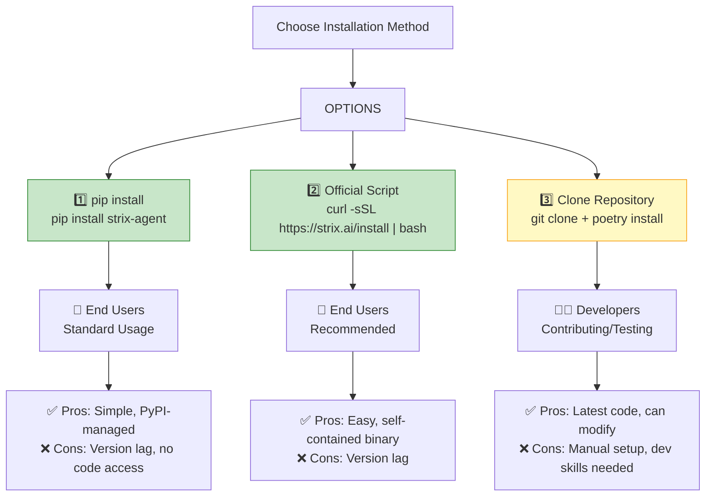
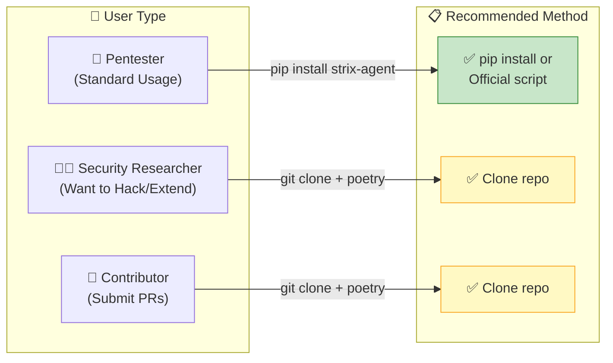
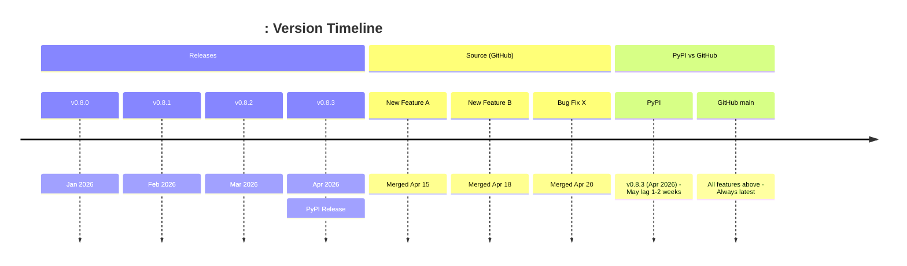

# Strix: pip install vs Clone Repository

**Short answer: NO, they are NOT the same**, but both give you a working `strix` command. Here's the full comparison:

---

## Installation Methods Comparison



---

## Detailed Comparison Table

| Feature | `pip install strix-agent` | `curl ... | bash` | `git clone + poetry` |
|---------|--------------------------|----------------------|----------------------|----------------------|
| **Ease of Setup** | ⭐⭐⭐⭐⭐ Easy | ⭐⭐⭐⭐ Easy | ⭐⭐⭐ Manual |
| **Version** | Latest PyPI release | Latest release | **Latest commit (unreleased)** |
| **Code Access** | ❌ No | ❌ No | ✅ Yes |
| **Can Modify** | ❌ No | ❌ No | ✅ Yes |
| **Contributing** | ❌ No | ❌ No | ✅ Yes |
| **Dependencies** | Managed by pip | Bundled | Poetry managed |
| **Recommended For** | End users | Most users | Developers |
| **Docker Setup** | Manual | Auto-checked | Manual |
| **Updates** | `pip install -U` | Re-run script | `git pull` |

---

## Method 1: pip install (Standard Users)

```bash
# Quick install
pip install strix-agent

# Or with pipx (recommended - isolated environment)
pipx install strix-agent

# Verify
strix --version
```

**What you get:**
- Latest **released version** from PyPI
- All dependencies managed by pip
- Ready to use immediately
- ❌ Cannot modify source code
- ❌ May lag behind GitHub by days/weeks

---

## Method 2: Official Install Script (Recommended)

```bash
# The easy way
curl -sSL https://strix.ai/install | bash

# Verify
strix --version
```

**What you get:**
- Pre-built binary (platform-specific)
- Automatic Docker check
- PATH setup
- ✅ **Recommended for most users**
- ❌ Cannot modify source code

---

## Method 3: Clone Repository (Developers)

```bash
# Clone the repo
git clone https://github.com/usestrix/strix.git
cd strix

# Install dependencies
poetry install

# OR for development with extras
poetry install --with dev

# OR with specific extras (Vertex AI, etc.)
poetry install --extras vertex

# Run from source
poetry run strix --version

# Or install in editable mode
pip install -e .
```

**What you get:**
- ✅ **Latest code** (including unreleased features)
- ✅ Can **modify and test** code
- ✅ Can **contribute** back
- ✅ Access to **skills, docs, tests**
- ✅ Development tooling (linting, testing)
- ❌ Manual dependency management
- ❌ Requires Python/dev environment knowledge

---

## When to Use Each Method



| Scenario | Best Method |
|----------|-------------|
| Running pentests for clients | `pip install` or script |
| Quick testing of an app | `pip install` or script |
| Want latest features (unreleased) | Clone repo |
| Contributing to Strix | Clone repo |
| Modifying/extending Strix | Clone repo |
| Testing a specific branch/fix | Clone repo |
| CI/CD pipeline | `pip install` or script |

---

## For Your Pentesters: Recommendation

**For your pentesters doing actual security testing:**

```bash
# ✅ RECOMMENDED: Use pip or official script
pipx install strix-agent

# OR
curl -sSL https://strix.ai/install | bash
```

**For developers/contributors:**

```bash
# Clone for latest features
git clone https://github.com/usestrix/strix.git
cd strix
poetry install --with dev
```

---

## Quick Decision Guide

```
┌─────────────────────────────────────────────────────────────┐
│              WHICH INSTALLATION METHOD?                     │
├─────────────────────────────────────────────────────────────┤
│                                                             │
│  Do you need to:                                           │
│                                                             │
│  1. JUST RUN STRIX for pentesting?                         │
│     → pip install strix-agent  ✅                          │
│                                                             │
│  2. Want the easiest setup?                                │
│     → curl -sSL https://strix.ai/install | bash  ✅        │
│                                                             │
│  3. Want LATEST code (unreleased features)?                │
│     → git clone + poetry install  ✅                       │
│                                                             │
│  4. Want to MODIFY or EXTEND Strix?                        │
│     → git clone + poetry install  ✅                       │
│                                                             │
│  5. Want to CONTRIBUTE to the project?                     │
│     → git clone + poetry install  ✅                       │
│                                                             │
└─────────────────────────────────────────────────────────────┘
```

---

## Version Access Comparison



---

## Running Strix on DGX Spark

For local LLM inference without cloud API costs, Strix can run on NVIDIA DGX Spark with Ollama or SGLang backends. The following screenshots show the DGX Spark environment:

<p align="center">
  
  <br/>
  <em>NVIDIA DGX Spark running Ubuntu — the hardware platform used for local LLM inference with Strix</em>
</p>

<p align="center">
  
  <br/>
  <em>DGX Dashboard showing system memory (11.88 GB used) and GPU utilization alongside JupyterLab — Strix leverages GPU-accelerated local inference for private, cost-free operation</em>
</p>

<p align="center">
  
  <br/>
  <em>Local LLM models available via Ollama on DGX Spark — large parameter models including qwen3.5:122b (81 GB), nemotron-3-super:120b (86 GB), and gpt-oss:120b (65 GB) for private inference</em>
</p>

---

## TL;DR

| Question | Answer |
|----------|--------|
| **Same functionality?** | ✅ Yes (when using latest release) |
| **Same version?** | ❌ No (pip/script may lag behind GitHub) |
| **Can modify code?** | ❌ pip/script = No / ✅ Repo = Yes |
| **Recommended for pentesters?** | ✅ pip/script |
| **Recommended for developers?** | ✅ Clone repo |
| **Recommended for contributors?** | ✅ Clone repo |