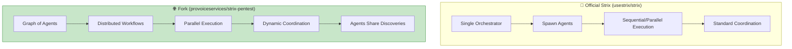

# Strix vs strix-pentest (provoiceservices fork) Comparison

## Overview

| Aspect | Official Strix (`usestrix/strix`) | Fork (`provoiceservices/strix-pentest`) |
|--------|-----------------------------------|----------------------------------------|
| **Primary Focus** | Standard autonomous pentesting | Multi-agent orchestration & scalability |
| **Architecture** | Single orchestrator + agents | **Graph of Agents** — distributed workflow |
| **Agent Execution** | Sequential/Parallel (standard) | **Parallel execution** with dynamic coordination |
| **Scalability** | Standard (single-node) | **Distributed** — multi-target parallel testing |

---

## Feature Comparison

| Feature | Official Strix | provoiceservices Fork |
|---------|---------------|----------------------|
| **HTTP Proxy** | ✅ Caido integration | ✅ Full HTTP Proxy |
| **Browser Automation** | ✅ Playwright | ✅ Multi-tab browser |
| **Terminal/Shell** | ✅ Interactive shells | ✅ Terminal environments |
| **Python Runtime** | ✅ Custom exploits | ✅ Exploit development |
| **CI/CD Integration** | ✅ GitHub Actions | ✅ GitHub Actions |
| **Headless Mode (`-n`)** | ✅ Supported | ✅ Supported |
| **Multi-Target Support** | ✅ (`-t` repeated) | ✅ Enhanced for scale |
| **Vulnerability Classes** | ✅ All standard | ✅ All standard |
| **Multi-Agent Orchestration** | ✅ Basic | ✅ **Graph of Agents** |
| **Distributed Workflows** | ❌ Not specified | ✅ **Specialized agents per attack type** |
| **Dynamic Coordination** | ❌ Standard | ✅ **Agents collaborate & share discoveries** |
| **Auto-Fix Generation** | ✅ Supported | ✅ Supported |

---

## Architecture Differences



| Architecture Element | Official Strix | Fork |
|---------------------|---------------|------|
| **Orchestration** | Centralized orchestrator | **Graph-based multi-agent** |
| **Agent Types** | Standard set (Recon, Injection, Auth, XSS, etc.) | **Specialized per attack/asset type** |
| **Collaboration** | Standard reporting | **Real-time discovery sharing** |
| **Scaling** | Limited by single-node | **Designed for parallel scale** |

---

## Use Case Fit

| Scenario | Recommended Version |
|----------|---------------------|
| Standard app pentesting | Either (both work) |
| Small-to-medium projects | Official Strix |
| **Large-scale/multi-target** | **Fork** (distributed advantage) |
| **Complex enterprise environments** | **Fork** (agent specialization) |
| **Research & experimentation** | Either |
| Contributing to core project | Official Strix |

---

## Repository Stats (as of search date)

| Metric | Official Strix | Fork |
|--------|---------------|------|
| **GitHub Stars** | 20k+ | Not specified |
| **Forks** | 2.1k | N/A |
| **Maintenance** | Active (regular releases) | Community-maintained |
| **Issue Tracking** | Active | Limited visibility |

---

## Installation

Both support the same installation methods:

```bash
# Official installer (works for both)
curl -sSL https://strix.ai/install | bash

# Or pip
pip install strix-agent
```

---

## Summary

| | Official Strix | provoiceservices Fork |
|--|---------------|----------------------|
| **Best For** | Most users, standard pentests | **Scale, parallel testing, complex environments** |
| **Key Advantage** | Stability, official support | **Distributed agent orchestration** |
| **Risk** | Lower (official project) | Higher (community fork, may diverge) |

**Recommendation**: Use **official Strix** for standard engagements. Consider the **fork** if you need distributed testing across many targets or want to experiment with advanced multi-agent orchestration patterns.
