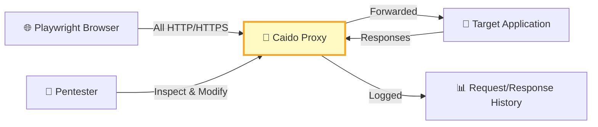
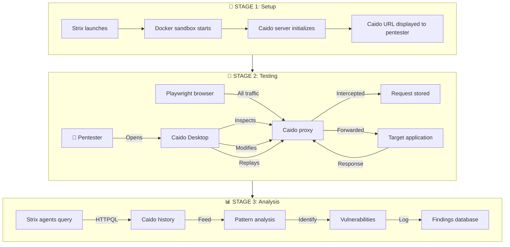

# What is Caido?

Caido is a **lightweight HTTP proxy tool** designed for web application security testing. In the context of Strix, it serves as the **primary interception and analysis layer** for all HTTP/HTTPS traffic between the browser automation and target applications.

---

## Overview

| Aspect | Description |
|--------|-------------|
| **Type** | HTTP/HTTPS proxy server |
| **Purpose** | Traffic interception, inspection, and modification |
| **Integration** | Built into Strix's Docker sandbox |
| **Access** | Local web UI (launched automatically by Strix) |
| **Relationship to Strix** | Core component for dynamic testing |

---

## Caido's Role in Strix

### 1. Traffic Interception

All browser requests and responses flow through Caido:



### 2. Key Functions in Strix

| Function | Description | How Strix Uses It |
|----------|-------------|-------------------|
| **Request/Response Logging** | Captures all HTTP traffic | Strix agents analyze patterns |
| **Request Replay** | Re-send requests with modifications | Testing IDOR, injection payloads |
| **Parameter Modification** | Edit request parameters on-the-fly | Quick vulnerability verification |
| **Sitemap Building** | Auto-discover application structure | Coverage assessment |
| **HTTPQL Filtering** | Query captured traffic | Focus on specific endpoints |
| **Scope Management** | Define testing boundaries | Respect scope rules |

---

## Caido vs Other Proxy Tools

| Feature | Caido (Strix) | Burp Suite | OWASP ZAP | mitmproxy |
|---------|-------------|------------|-----------|-----------|
| **Automation API** | ✅ Native | ✅ (Enterprise) | ✅ | ✅ |
| **Lightweight** | ✅ Yes | ❌ Heavy | ⚠️ Medium | ✅ Yes |
| **Browser Integration** | ✅ Playwright | ⚠️ Manual | ⚠️ Manual | ⚠️ Manual |
| **HTTPQL** | ✅ Built-in | ❌ No | ❌ No | ❌ No |
| **Strix Integration** | ✅ Native | ❌ None | ❌ None | ❌ None |
| **Desktop UI** | ✅ Yes | ✅ Yes | ✅ Yes | ⚠️ Limited |

---

## How Strix Uses Caido

### Automated Usage (Agent-Driven)

Strix agents interact with Caido programmatically:

```python
# Example: List captured requests
list_requests(
    httpql_filter='req.path.cont:"/users/"',
    page_size=50
)

# Example: Replay with modifications
repeat_request(
    request_id="req_123",
    modifications={
        'url': '/api/users/2',  # Test IDOR
        'headers': {'Authorization': 'Bearer invalid'}
    }
)

# Example: Send new request
send_request(
    method='POST',
    url='https://target.com/api/login',
    body='{"user":"test","pass":"test"}'
)
```

### Manual Usage (Pentester-Driven)

When Strix launches, it exposes Caido's URL:

```bash
$ strix --target https://example.com

[Strix] Caido proxy available at: http://localhost:52341
```

The pentester can:

1. **Open Caido Desktop** (or web UI at the provided URL)
2. **Browse the target** — all traffic appears in Caido
3. **Inspect requests** — view headers, parameters, bodies
4. **Modify and replay** — test variations manually
5. **Filter traffic** — HTTPQL queries like `req.path.cont:"/api"`
6. **Export findings** — save request/response pairs as evidence

---

## Caido Core Features

### 1. Request History

```
┌─────────────────────────────────────────────────────────────┐
│  Method │ Path               │ Status │ Size │ Time       │
├─────────────────────────────────────────────────────────────┤
│  GET    │ /api/users         │ 200    │ 1.2K │ 12:34:56   │
│  POST   │ /api/login         │ 200    │ 890B │ 12:35:01   │
│  GET    │ /api/users/123     │ 200    │ 450B │ 12:35:10   │ ← IDOR target
│  GET    │ /admin/dashboard   │ 403    │ 120B │ 12:35:15   │ ← Auth check
└─────────────────────────────────────────────────────────────┘
```

### 2. HTTPQL Query Language

Filter captured traffic with queries:

| Query | Purpose |
|-------|---------|
| `req.path.cont:"/api"` | Find API requests |
| `req.method:POST` | POST requests only |
| `resp.status:200` | Successful responses |
| `req.body.cont:"password"` | Requests with passwords |
| `req.host:api.target.com` | Specific host |

### 3. Request Modification

Intercept and modify before forwarding:

```
Original:  GET /api/users/123
Modified:  GET /api/users/1    ← Testing IDOR

Original:  Authorization: Bearer valid_token
Modified:  Authorization: Bearer invalid   ← Testing auth bypass
```

### 4. Replay & Automation

```python
# Automated IDOR testing via Caido
captured = list_requests(httpql_filter='req.path.cont:"/users/"')

for req in captured['requests']:
    # Try different user IDs
    for user_id in [1, 2, 3, 999]:
        modified_url = req['path'].replace('/users/123', f'/users/{user_id}')
        response = repeat_request(req['id'], {'url': modified_url})
        
        if response['status_code'] == 200:
            print(f"POTENTIAL IDOR: {modified_url}")
```

---

## Caido in the Strix Workflow



---

## When Caido is Essential

| Scenario | Why Caido Matters |
|----------|-----------------|
| **IDOR Testing** | Modify IDs in requests to test horizontal/vertical privilege escalation |
| **Authentication Bypass** | Replay requests without/with modified auth tokens |
| **Parameter Tampering** | Change POST/GET parameters to test business logic |
| **Header Injection** | Add/modify headers (X-Forwarded-For, etc.) |
| **Session Analysis** | Inspect cookie/session handling across requests |
| **API Discovery** | Build sitemap of undocumented endpoints |
| **Request Smuggling** | Craft malformed requests for advanced testing |
| **Traffic Analysis** | Identify patterns, technologies, behavior |

---

## Caido Limitations

| Limitation | Impact | Workaround |
|------------|--------|------------|
| **WebSocket support** | Limited | Use browser automation directly |
| **Binary protocols** | Not supported | Strix uses other tools |
| **Certificate pinning** | May fail | Strix handles SSL via Docker |
| **Heavy traffic** | Performance | Built-in rate limiting in Strix |

---

## Quick Reference: Caido + Strix

```bash
# Start scan (Caido auto-launches)
strix --target https://app.example.com

# Note the Caido URL in output:
# [Caido] Proxy available at: http://localhost:52341

# Open in browser or Caido Desktop
open http://localhost:52341

# In Caido UI:
# - Watch traffic in "History" tab
# - Filter with HTTPQL
# - Right-click → "Replay" to modify
# - View sitemap for coverage
```

---

## Summary

Caido is the **traffic interception backbone** of Strix's dynamic testing capability. It bridges the gap between automated agent testing and human pentester intuition by providing:

1. **Full visibility** into all HTTP/HTTPS traffic
2. **Manual inspection** capabilities for human analysis
3. **Request modification** for rapid vulnerability verification
4. **Automated querying** for agent-driven analysis
5. **Sitemap generation** for coverage assessment

Without Caido, Strix would lack the **human-in-the-loop** capability that distinguishes it from fully automated scanners, making it a core component of the HITL (Human-in-the-Loop) architecture.

---

**Learn more:** [https://caido.io/](https://caido.io/) (Caido's official website)
