# End-to-End Autonomous Pentesting Template for Strix

---

## Main Configuration File: `pentest-config.yaml`

```yaml
# =============================================================================
# STRIX END-TO-END AUTONOMOUS PENTEST CONFIGURATION
# =============================================================================
# This file orchestrates a complete penetration test from source analysis
# through production scanning to final reporting.
# 
# Usage:
#   strix -n --instruction-file ./pentest-config.yaml [targets...]
# =============================================================================

metadata:
  engagement_name: "Autonomous Pentest"
  scope: "full"
  autonomy_level: "maximum"
  phases:
    - source_analysis
    - vuln_validation
    - uat_scanning
    - prod_scanning
    - reporting

# =============================================================================
# PHASE 1: SOURCE CODE ANALYSIS (Static Analysis)
# =============================================================================
phase_1_source_analysis:
  enabled: true
  description: "Static analysis of source code to identify vulnerabilities"
  
  targets:
    - type: "local_directory"
      path: "./"
      priority: "primary"
  
  objectives:
    - "Perform SAST using Semgrep with security rulesets"
    - "Run secret detection (gitleaks, trufflehog)"
    - "Execute dependency vulnerability scanning (trivy)"
    - "Perform AST-based code analysis (ast-grep)"
    - "Identify SQL injection candidates"
    - "Find hardcoded credentials and API keys"
    - "Detect authentication/authorization weaknesses"
    - "Map attack surface from source code"
  
  tools:
    - semgrep
    - gitleaks
    - trufflehog
    - trivy
    - ast-grep
    - bandit
  
  scan_depth: "deep"
  focus_areas:
    - sql_injection
    - command_injection
    - xss
    - idor
    - authentication_bypass
    - secrets_exposure
    - insecure_deserialization
    - path_traversal
  
  output:
    directory: "phase1_source_findings"
    formats:
      - json
      - md
    include_code_snippets: true

# =============================================================================
# PHASE 2: VULNERABILITY VALIDATION & RANKING
# =============================================================================
phase_2_vuln_validation:
  enabled: true
  description: "Validate and prioritize findings from Phase 1"
  
  objectives:
    - "Cross-reference source findings with known patterns"
    - "Rank vulnerabilities by severity (CVSS)"
    - "Identify false positives"
    - "Create validated vulnerability list"
    - "Prepare testing plan for dynamic validation"
  
  validation_criteria:
    - "Must have concrete evidence in source"
    - "Must be exploitable (confirmed via path analysis)"
    - "Must have clear impact statement"
    - "Must have remediation recommendation"
  
  prioritization:
    method: "cvss_score"
    tiers:
      - critical
      - high
      - medium
      - low
  
  output:
    directory: "phase2_validated_findings"
    formats:
      - json
      - md
    include_exploitability_assessment: true

# =============================================================================
# PHASE 3: UAT ENVIRONMENT SCANNING
# =============================================================================
phase_3_uat_scanning:
  enabled: true
  description: "Dynamic testing against UAT/Staging environment"
  
  targets:
    - type: "web_application"
      url: "${UAT_URL}"
      priority: "primary"
    - type: "api"
      url: "${UAT_API_URL}"
      priority: "primary"
  
  credentials:
    test_accounts:
      - username: "${UAT_TEST_USER}"
        password: "${UAT_TEST_PASS}"
        role: "standard_user"
      - username: "${UAT_ADMIN_USER}"
        password: "${UAT_ADMIN_PASS}"
        role: "admin_user"
      - username: "${UAT_API_KEY}"
        type: "api_key"
        role: "service_account"
  
  objectives:
    - "Validate Phase 1 findings dynamically"
    - "Discover new vulnerabilities in UAT"
    - "Test authentication mechanisms"
    - "Test authorization controls (IDOR, BOLA)"
    - "Test for injection vulnerabilities"
    - "Test business logic flows"
    - "Test API security"
    - "Capture all traffic for analysis"
  
  testing_scope:
    include:
      - "/api/*"
      - "/admin/*"
      - "/user/*"
      - "/auth/*"
      - "/dashboard/*"
      - "/upload/*"
      - "/payment/*"
    exclude:
      - "/health/*"
      - "/metrics/*"
      - "/static/*"
  
  focus_areas:
    - idor
    - authentication_bypass
    - sql_injection
    - xss
    - csrf
    - business_logic_flaws
    - api_security
    - jwt_vulnerabilities
  
  safety:
    rate_limit_requests: true
    max_requests_per_minute: 60
    destructive_testing: false
    data_modification: false
    out_of_band_testing: true
  
  tools:
    - browser_automation
    - http_proxy
    - sqlmap
    - nuclei
    - ffuf
    - arjun
  
  output:
    directory: "phase3_uat_findings"
    formats:
      - json
      - md
      - html
    include_traffic_logs: true
    include_screenshots: true

# =============================================================================
# PHASE 4: PROD ENVIRONMENT SCANNING
# =============================================================================
phase_4_prod_scanning:
  enabled: true
  description: "Conservative testing against production environment"
  
  targets:
    - type: "web_application"
      url: "${PROD_URL}"
      priority: "primary"
    - type: "api"
      url: "${PROD_API_URL}"
      priority: "primary"
  
  credentials:
    test_accounts:
      - username: "${PROD_TEST_USER}"
        password: "${PROD_TEST_PASS}"
        role: "limited_test"
        permissions: "read_only"
  
  authorization: "EXPLICIT_PROD_AUTHORIZATION_REQUIRED"
  
  objectives:
    - "Validate critical findings from UAT"
    - "Test for information disclosure"
    - "Test public-facing endpoints"
    - "Test for critical vulnerabilities only"
    - "NO active exploitation in PROD"
    - "Passive reconnaissance only"
  
  safety_constraints:
    rate_limit_requests: true
    max_requests_per_minute: 10
    destructive_testing: false
    data_modification: false
    out_of_band_testing: true
    intrusive_scans: false
  
  scope:
    include:
      - "/"
      - "/public/*"
      - "/login"
      - "/api/public/*"
    exclude:
      - "/admin/*"
      - "/user/*"
      - "/dashboard/*"
      - "/api/*"
      - "/settings/*"
  
  focus_areas:
    - information_disclosure
    - publicly_exploitable_vulns
    - misconfigurations
    - ssl_tls_issues
  
  tools:
    - browser_automation
    - nuclei
    - httpx
    - ssl_scan
  
  output:
    directory: "phase4_prod_findings"
    formats:
      - json
      - md
    include_recon_only: true

# =============================================================================
# PHASE 5: REPORTING
# =============================================================================
phase_5_reporting:
  enabled: true
  description: "Generate comprehensive penetration test report"
  
  report_type: "full_pentest_report"
  
  sections:
    - executive_summary
    - methodology
    - scope
    - findings
    - remediation
    - appendix
  
  findings:
    include:
      - all_validated_findings
      - cvss_scores
      - proof_of_concept
      - impact_analysis
      - remediation_steps
      - references
  
  formats:
    - markdown
    - html
    - json
  
  output:
    directory: "final_report"
    filename: "pentest_report_${DATE}"
  
  distribution:
    stakeholders: true
    technical: true
    executive: true

# =============================================================================
# AUTONOMOUS EXECUTION SETTINGS
# =============================================================================
autonomous_settings:
  max_iterations: 300
  reasoning_effort: "high"
  tool_timeout: 120
  llm_timeout: 300
  
  error_handling:
    retry_on_failure: true
    max_retries: 3
    continue_on_error: true
  
  progress_reporting:
    log_level: "INFO"
    report_interval: 300
    save_intermediate_results: true
  
  resource_limits:
    max_concurrent_agents: 5
    max_browser_instances: 3
    max_memory_mb: 4096
```

---

## Environment Variables File: `.env.strix`

```bash
# =============================================================================
# STRIX ENVIRONMENT CONFIGURATION
# =============================================================================
# Copy this file to .env and fill in your values
# Usage: export $(cat .env | xargs) && strix --instruction-file ./pentest-config.yaml

# =============================================================================
# LLM CONFIGURATION (Required)
# =============================================================================
STRIX_LLM="openai/gpt-5.4"
LLM_API_KEY="sk-..."

# Optional: Local model configuration
# STRIX_LLM="ollama/llama3.3:70b"
# LLM_API_BASE="http://localhost:11434"

# =============================================================================
# TARGET ENVIRONMENTS
# =============================================================================

# UAT/Staging Environment
UAT_URL="https://uat.target-app.example.com"
UAT_API_URL="https://uat-api.target-app.example.com"

# Production Environment
PROD_URL="https://target-app.example.com"
PROD_API_URL="https://api.target-app.example.com"

# =============================================================================
# TEST ACCOUNTS - UAT
# =============================================================================
UAT_TEST_USER="pentest_user@example.com"
UAT_TEST_PASS="SecureP@ssw0rd123!"

UAT_ADMIN_USER="pentest_admin@example.com"
UAT_ADMIN_PASS="Adm1n!S3cureP@ss"

UAT_API_KEY="sk_test_uat_a1b2c3d4e5f6"

# =============================================================================
# TEST ACCOUNTS - PROD (LIMITED PERMISSIONS!)
# =============================================================================
PROD_TEST_USER="strix_pentest_prod@example.com"
PROD_TEST_PASS="Pr0dT3st!S3cure"

# =============================================================================
# OPTIONAL: PERPLEXITY FOR OSINT
# =============================================================================
PERPLEXITY_API_KEY="pplx-..."

# =============================================================================
# PERFORMANCE TUNING
# =============================================================================
STRIX_REASONING_EFFORT="high"
STRIX_SANDBOX_EXECUTION_TIMEOUT=120
LLM_TIMEOUT=300
STRIX_LLM_MAX_RETRIES=5

# =============================================================================
# TELEMETRY (Disable for privacy)
# =============================================================================
STRIX_TELEMETRY="0"
```

---

## Comprehensive Instruction File: `full-pentest-instructions.md`

```markdown
# =============================================================================
# STRIX FULL AUTONOMOUS PENTEST INSTRUCTIONS
# =============================================================================
# This instruction file guides Strix through a complete penetration test:
#   1. Source Code Analysis
#   2. Vulnerability Validation
#   3. UAT Environment Testing
#   4. Production Environment Testing
#   5. Report Generation
#
# Execute with:
#   strix -n --instruction-file ./full-pentest-instructions.md
# =============================================================================

## ENGAGEMENT OVERVIEW

You are conducting a comprehensive, autonomous penetration test. Execute each
phase systematically and maintain findings across phases for maximum efficiency.

## PHASE 1: SOURCE CODE ANALYSIS

### Objective
Perform thorough static analysis of the provided source code repository to
identify security vulnerabilities, secrets, and attack surface.

### Actions

1. **Clone and Analyze Repository Structure**
   - Map the directory structure
   - Identify technology stack (language, framework, dependencies)
   - Identify entry points (APIs, web routes, CLIs)

2. **Secret Scanning**
   ```bash
   # Run gitleaks for secrets
   gitleaks detect --source . --report-format json --report-path ./findings/gitleaks.json
   
   # Run trufflehog for historical secrets
   trufflehog filesystem . --json > ./findings/trufflehog.json
   
   # Run semgrep for hardcoded secrets
   semgrep --config p/secrets --json --output ./findings/semgrep-secrets.json .
   ```

3. **SAST Scanning**
   ```bash
   # Security-focused semgrep scan
   semgrep --config p/default --config p/security-audit \
     --metrics=off --json --output ./findings/semgrep-security.json .
   
   # Framework-specific rules (adjust based on stack)
   semgrep --config p/python --config p/django --json \
     --output ./findings/semgrep-framework.json . 2>/dev/null || true
   ```

4. **Dependency Scanning**
   ```bash
   # Trivy dependency scan
   trivy fs --scanners vuln,misconfig --timeout 30m \
     --format json --output ./findings/trivy-deps.json .
   
   # Check for known CVEs
   trivy fs --scanners vuln --vuln-type os,library \
     --output ./findings/trivy-cves.json .
   ```

5. **Structural Code Analysis**
   ```bash
   # AST-based pattern hunting with ast-grep
   # Search for dangerous patterns:
   # - SQL query construction
   # - Command execution
   # - File operations with user input
   # - Authentication/authorization checks
   
   mkdir -p ./findings/ast-analysis
   
   # Example: Find SQL queries with string concatenation
   sg run --pattern 'cursor.execute($SQL + $USER)' --json \
     > ./findings/ast-analysis/sql-dangerous.json 2>/dev/null || true
   ```

6. **Vulnerability Class Focus**
   For each of the following, search for patterns and validate:

   - **SQL/NoSQL Injection**: String-concatenated queries, ORM misuse
   - **Command Injection**: exec(), eval(), system(), child_process
   - **XSS**: InnerHTML, document.write, unsanitized output
   - **IDOR**: Object references without authorization checks
   - **Authentication**: Missing auth checks, weak crypto
   - **Path Traversal**: File operations with unsanitized paths
   - **Deserialization**: pickle, yaml, json.loads with untrusted data

7. **Create Source Findings Summary**
   Document all findings with:
   - File path and line number
   - Vulnerability type
   - Code snippet
   - Impact assessment
   - Suggested remediation

### Output
Save Phase 1 results to `./phase1_source_findings/`:
- `findings.json` - All findings in structured format
- `findings.md` - Human-readable summary
- `secrets.json` - Secret exposure findings
- `vulns.json` - Technical vulnerability details

---

## PHASE 2: VULNERABILITY VALIDATION & RANKING

### Objective
Validate findings from Phase 1, eliminate false positives, and create
a prioritized testing plan for dynamic analysis.

### Actions

1. **False Positive Elimination**
   For each finding:
   - Verify the code pattern is actually exploitable
   - Check if there are mitigating controls
   - Assess if the vulnerability is reachable from entry points
   - Mark as: CONFIRMED, LIKELY, FALSE_POSITIVE

2. **CVSS Scoring**
   Calculate CVSS v3.1 score for each confirmed finding:
   - Attack Vector (Network/Adjacent/Local/Physical)
   - Attack Complexity (Low/High)
   - Privileges Required (None/Low/High)
   - User Interaction (None/Required)
   - Scope (Unchanged/Changed)
   - Impact (Confidentiality/Integrity/Availability)

3. **Exploitability Assessment**
   - Can this be exploited remotely?
   - What are the prerequisites?
   - Can it be chained with other vulnerabilities?
   - What is the realistic impact?

4. **Prioritization**
   Create ranked list:
   ```
   P1 - CRITICAL: RCE, SQLi with data extraction, Auth bypass
   P2 - HIGH: IDOR, XSS with impact, SSRF to internal
   P3 - MEDIUM: Self-XSS, weak crypto, info disclosure
   P4 - LOW: Informational, best practice violations
   ```

5. **Dynamic Testing Plan**
   For each P1 and P2 finding, create a testing task:
   - Target endpoint/function
   - Testing methodology
   - Expected behavior
   - Success criteria

### Output
Save Phase 2 results to `./phase2_validated_findings/`:
- `validated_findings.json` - Confirmed vulnerabilities
- `testing_plan.json` - Prioritized testing tasks
- `false_positives.json` - Eliminated findings with rationale

---

## PHASE 3: UAT ENVIRONMENT DYNAMIC TESTING

### Objective
Perform dynamic security testing against the UAT/Staging environment to
validate source findings and discover new vulnerabilities.

### Target Configuration

**Environment**: UAT (Staging)
**URL**: Use environment variable $UAT_URL or configured target
**API**: Use environment variable $UAT_API_URL if applicable

### Test Account Credentials

**Standard User**:
- Username: $UAT_TEST_USER
- Password: $UAT_TEST_PASS
- Role: Standard user with typical permissions

**Admin User**:
- Username: $UAT_ADMIN_USER
- Password: $UAT_ADMIN_PASS
- Role: Administrator

**API Key** (if applicable):
- Key: $UAT_API_KEY
- Type: Bearer token in Authorization header

### Actions

1. **Reconnaissance**
   ```bash
   # Passive recon
   subfinder -d $UAT_DOMAIN -o ./recon/subdomains.txt
   
   # HTTP probing
   httpx -l ./recon/subdomains.txt -silent -title -tech-detect
   
   # Crawling
   katana -u $UAT_URL -o ./recon/crawled_urls.txt
   
   # Directory discovery
   ffuf -u $UAT_URL/FUZZ -w wordlist.txt -o ./recon/dirs.json
   ```

2. **Browser-Based Testing**
   Launch headless browser and perform:

   a. **Authentication Testing**
   - Test login with valid/invalid credentials
   - Test password reset flows
   - Test account lockout policies
   - Test MFA if present
   - Capture auth tokens and sessions

   b. **Navigation Testing**
   - Browse all accessible pages
   - Capture all HTTP traffic via proxy
   - Build sitemap of application
   - Identify attack surface

   c. **Client-Side Testing**
   - Test XSS in all input fields
   - Test DOM manipulation
   - Analyze JavaScript for secrets
   - Test WebSocket connections

3. **Proxy Traffic Analysis**
   Use captured traffic to test:

   a. **IDOR Testing**
   ```
   For each request with object references (IDs, UUIDs):
   1. Change the ID to another user's ID
   2. Change the ID to a non-existent value
   3. Check for horizontal privilege escalation
   4. Check for vertical privilege escalation
   ```

   b. **Authorization Testing**
   ```
   1. Access resources without authentication
   2. Access admin resources as standard user
   3. Access another user's resources
   4. Bypass authorization checks via method tampering
   ```

   c. **Parameter Manipulation**
   ```
   1. Test for mass assignment
   2. Test parameter pollution
   3. Test for hidden parameter discovery
   4. Test for HTTP parameter contamination
   ```

4. **Injection Testing**

   a. **SQL Injection**
   ```
   Target: All parameters, headers, cookies
   Payloads:
   - '
   - OR 1=1
   - UNION SELECT
   - WAITFOR DELAY
   - Boolean-based blind
   - Time-based blind
   
   Use sqlmap for confirmed vectors:
   sqlmap -r request.txt --batch --risk=3 --level=5
   ```

   b. **XSS Testing**
   ```
   Reflected XSS:
   - Test all GET parameters
   - Test all POST parameters
   - Test headers (User-Agent, Referer)
   
   Stored XSS:
   - Test all input fields that persist
   - Profile fields, comments, uploads
   
   DOM XSS:
   - Test client-side JavaScript sinks
   
   Payloads:
   - <script>alert(1)</script>
   - 
   - <svg onload=alert(1)>
   - javascript:alert(1)
   ```

   c. **Command Injection**
   ```
   Target: System calls, shell commands
   Payloads:
   - ; whoami
   - | cat /etc/passwd
   - $(whoami)
   - `id`
   ```

   d. **SSRF Testing**
   ```
   Target: URLs, file paths, redirects
   Payloads:
   - http://localhost/admin
   - http://169.254.169.254/latest/meta-data/
   - file:///etc/passwd
   - dict://localhost:11211/stats
   ```

5. **API Testing** (if applicable)
   ```
   REST API:
   - Enumerate endpoints
   - Test HTTP methods (GET, POST, PUT, DELETE, PATCH)
   - Test authentication/authorization
   - Test rate limiting
   - Test input validation
   
   GraphQL:
   - Introspection query
   - Batch queries for DoS
   - Alias abuse
   - Depth limit bypass
   ```

6. **Business Logic Testing**
   ```
   - Test for race conditions in transactions
   - Test for workflow bypasses
   - Test for parameter tampering (prices, quantities)
   - Test for insufficient flow validation
   - Test for authentication state issues
   ```

7. **JWT Testing** (if applicable)
   ```
   - Check for "none" algorithm
   - Test algorithm confusion
   - Test weak secret keys
   - Test token expiration
   - Test missing signature validation
   ```

### Output
Save Phase 3 results to `./phase3_uat_findings/`:
- `dynamic_findings.json` - All findings from testing
- `traffic_logs.json` - Captured HTTP traffic
- `screenshots/` - Visual evidence
- `pocs/` - Proof-of-concept scripts
- `requests/` - Replayable HTTP requests

---

## PHASE 4: PRODUCTION ENVIRONMENT TESTING

### ⚠️ IMPORTANT: SAFETY FIRST

**Production testing is CRITICAL and RESTRICTED.**
- Authorization MUST be confirmed before proceeding
- ONLY test public-facing endpoints
- Use EXTREME rate limiting
- NO destructive testing
- NO data modification
- Focus on CRITICAL vulnerabilities only

### Target Configuration

**Environment**: PRODUCTION
**URL**: Use environment variable $PROD_URL
**Scope**: PUBLIC endpoints only

### Test Account Credentials

**Limited Test Account**:
- Username: $PROD_TEST_USER
- Password: $PROD_TEST_PASS
- Permissions: READ-ONLY, NO WRITE OPERATIONS

### Actions

1. **Passive Reconnaissance**
   ```bash
   # DNS enumeration
   dig $PROD_DOMAIN
   nslookup $PROD_DOMAIN
   
   # SSL/TLS analysis
   echo | openssl s_client -connect $PROD_DOMAIN:443
   sslscan $PROD_DOMAIN
   ```

2. **Public Endpoint Testing**
   
   a. **Information Disclosure**
   ```
   - Check for debug pages
   - Check for exposed configuration
   - Check for verbose error messages
   - Check for directory listing
   ```

   b. **Critical Vulnerability Check**
   ```
   Use Nuclei with critical severity templates:
   nuclei -u $PROD_URL -t ./nuclei-templates/critical/ \
     -severity critical,high -o ./prod_findings/nuclei.json
   ```

   c. **HTTP Security Headers**
   ```
   Check for:
   - Strict-Transport-Security
   - Content-Security-Policy
   - X-Frame-Options
   - X-Content-Type-Options
   - Referrer-Policy
   - Permissions-Policy
   ```

3. **Validated Findings Testing** (CRITICAL ONLY)
   
   ONLY test P1 findings from Phase 2/3 that:
   - Affect public endpoints
   - Can be exploited without authentication
   - Have severe impact
   
   Use minimal test cases:
   - Confirm existence with blind tests
   - Do NOT extract data
   - Do NOT modify systems
   - Document with timestamped evidence

### Output
Save Phase 4 results to `./phase4_prod_findings/`:
- `prod_findings.json` - Production findings
- `nuclei_results.json` - Scanner output
- `headers_analysis.json` - Security headers check
- `passive_recon.json` - Reconnaissance data

---

## PHASE 5: REPORT GENERATION

### Objective
Create comprehensive penetration test report with all findings, evidence,
and remediation guidance.

### Report Structure

1. **Executive Summary**
   - Overall security posture assessment
   - Key findings summary
   - Risk rating
   - Recommendations priority

2. **Methodology**
   - Testing approach
   - Tools used
   - Coverage assessment
   - Limitations

3. **Scope Definition**
   - Targets tested
   - Environment details
   - Credentials used
   - Exclusions

4. **Findings Detail**
   For each finding:
   - Title
   - Severity (CVSS Score)
   - Description
   - Evidence (screenshots, logs, PoC)
   - Impact
   - Remediation
   - References (CWE, CVE, etc.)
   - Proof of Concept

5. **Remediation Roadmap**
   - Immediate actions (Critical findings)
   - Short-term actions (High findings)
   - Long-term improvements (Medium/Low)

6. **Appendix**
   - Tool output logs
   - Traffic captures
   - Raw scanner results

### Output Formats
```
final_report/
├── executive_summary.md
├── full_report.html
├── full_report.md
├── findings.json
├── findings_by_severity/
│   ├── critical.json
│   ├── high.json
│   ├── medium.json
│   └── low.json
├── evidence/
│   ├── screenshots/
│   ├── pocs/
│   └── logs/
└── raw_data/
    ├── phase1_findings/
    ├── phase2_findings/
    ├── phase3_findings/
    └── phase4_findings/
```

---

## AUTONOMOUS EXECUTION RULES

### Decision Making
1. **Proceed autonomously** through all phases unless:
   - Authorization is unclear
   - Safety constraints are violated
   - Critical error occurs
   
2. **If blocked:**
   - Log the issue
   - Document what was attempted
   - Continue with next task
   - Flag for human review

3. **Error Handling:**
   - Retry failed operations up to 3 times
   - Log all errors with context
   - Continue testing if one tool fails
   - Never stop the entire engagement

### Quality Standards
- **Every finding needs:**
  - Evidence (screenshot, log, response)
  - Impact statement
  - Remediation recommendation
  - CVSS score

- **PoC Requirements:**
  - Must demonstrate exploitability
  - Must be reproducible
  - Must not cause damage
  - Must be safe to execute

### Progress Tracking
- Log phase completion
- Track findings count by severity
- Report token usage
- Report estimated cost

---

## START EXECUTION

Begin with Phase 1. Execute all phases sequentially unless configured otherwise.
Report progress at each phase completion.

For questions or clarification, note them in the output but continue execution.

**Good luck, autonomous pentester. Begin.**
```

---

## Quick Start Script: `run-pentest.sh`

```bash
#!/bin/bash
# =============================================================================
# STRIX FULL AUTONOMOUS PENTEST EXECUTION SCRIPT
# =============================================================================

set -e

# Load environment variables
if [ -f .env.strix ]; then
    export $(cat .env.strix | xargs)
    echo "✓ Environment variables loaded"
else
    echo "✗ .env.strix not found. Copy template and configure."
    exit 1
fi

# Validate required variables
required_vars=("STRIX_LLM" "LLM_API_KEY" "UAT_URL")
for var in "${required_vars[@]}"; do
    if [ -z "${!var}" ]; then
        echo "✗ $var is not set"
        exit 1
    fi
done
echo "✓ Required variables validated"

# Create output directories
mkdir -p strix_runs/pentest_$(date +%Y%m%d_%H%M%S)
cd strix_runs/pentest_$(date +%Y%m%d_%H%M%S)
WORK_DIR=$(pwd)

# Create symlinks for easier access
ln -sf . phase1_source_findings
ln -sf . phase2_validated_findings
ln -sf . phase3_uat_findings
ln -sf . phase4_prod_findings
ln -sf . final_report

echo "✓ Working directory: $WORK_DIR"

# Display configuration
echo ""
echo "━━━━━━━━━━━━━━━━━━━━━━━━━━━━━━━━━━━━━━━━━━━━━━━━━━━━━━━━━━━━━━━━━━━━━━"
echo "STRIX AUTONOMOUS PENTEST CONFIGURATION"
echo "━━━━━━━━━━━━━━━━━━━━━━━━━━━━━━━━━━━━━━━━━━━━━━━━━━━━━━━━━━━━━━━━━━━━━━"
echo "LLM Model:     $STRIX_LLM"
echo "UAT URL:       $UAT_URL"
echo "UAT API:       ${UAT_API_URL:-not configured}"
echo "PROD URL:      ${PROD_URL:-not configured}"
echo "Scan Mode:     deep"
echo "Output Dir:    $WORK_DIR"
echo "━━━━━━━━━━━━━━━━━━━━━━━━━━━━━━━━━━━━━━━━━━━━━━━━━━━━━━━━━━━━━━━━━━━━━━"
echo ""

# Execute Strix
echo "[*] Starting autonomous pentest..."
echo ""

strix -n \
    --target ./ \
    --target "$UAT_URL" \
    --scan-mode deep \
    --instruction-file ../full-pentest-instructions.md \
    2>&1 | tee "$WORK_DIR/strix_output.log"

# Capture exit code
EXIT_CODE=${PIPESTATUS[0]}

# Generate summary
echo ""
echo "━━━━━━━━━━━━━━━━━━━━━━━━━━━━━━━━━━━━━━━━━━━━━━━━━━━━━━━━━━━━━━━━━━━━━━"
echo "PENTEST EXECUTION COMPLETE"
echo "━━━━━━━━━━━━━━━━━━━━━━━━━━━━━━━━━━━━━━━━━━━━━━━━━━━━━━━━━━━━━━━━━━━━━━"
echo "Exit Code: $EXIT_CODE"
echo "Output Directory: $WORK_DIR"
echo ""

if [ -d "$WORK_DIR" ]; then
    echo "Generated Files:"
    find "$WORK_DIR" -type f -name "*.json" -o -name "*.md" -o -name "*.html" | head -20
fi

echo ""
echo "[*] Pentest execution finished."

exit $EXIT_CODE
```

---

## Mermaid Diagram: End-to-End Flow

```mermaid
flowchart TB
    subgraph INIT["🚀 INITIALIZATION"]
        INIT1[Load Configuration]
        INIT2[Validate Environment]
        INIT3[Create Output Directories]
        INIT4[Log Start Time]
    end

    subgraph P1["📋 PHASE 1: SOURCE ANALYSIS"]
        P1A[Clone/Analyze Source]
        P1B[Run SAST Scans]
        P1C[Secret Detection]
        P1D[Dependency Scan]
        P1E[AST Pattern Analysis]
        P1F[Create Findings Report]
    end

    subgraph P2["✅ PHASE 2: VALIDATION"]
        P2A[Eliminate False Positives]
        P2B[Calculate CVSS Scores]
        P2C[Assess Exploitability]
        P2D[Create Testing Plan]
    end

    subgraph P3["⚡ PHASE 3: UAT TESTING"]
        P3A[Reconnaissance]
        P3B[Browser Automation]
        P3C[Proxy Analysis]
        P3D[IDOR Testing]
        P3E[Injection Testing]
        P3F[API Testing]
        P3G[Business Logic]
    end

    subgraph P4["🏭 PHASE 4: PROD TESTING"]
        P4A[Passive Recon]
        P4B[Critical Scan Only]
        P4C[Headers Check]
        P4D[Validate P1 Findings]
    end

    subgraph P5["📊 PHASE 5: REPORTING"]
        P5A[Compile All Findings]
        P5B[Generate Executive Summary]
        P5C[Create Technical Report]
        P5D[Export Multiple Formats]
        P5E[Create Remediation Plan]
    end

    subgraph FINISH["✅ COMPLETION"]
        F1[Log End Time]
        F2[Calculate Metrics]
        F3[Archive Results]
        F4[Exit with Code]
    end

    INIT1 --> INIT2 --> INIT3 --> INIT4
    INIT4 --> P1A
    
    P1A --> P1B --> P1C --> P1D --> P1E --> P1F
    P1F --> P2A
    P2A --> P2B --> P2C --> P2D
    P2D --> P3A
    P3A --> P3B --> P3C --> P3D --> P3E --> P3F --> P3G
    P3G --> P4A
    P4A --> P4B --> P4C --> P4D
    P4D --> P5A
    P5A --> P5B --> P5C --> P5D --> P5E
    P5E --> F1 --> F2 --> F3 --> F4

    style INIT fill:#e1bee7,stroke:#7b1fa2
    style P1 fill:#bbdefb,stroke:#1976d2
    style P2 fill:#c8e6c9,stroke:#388e3c
    style P3 fill:#fff9c4,stroke:#f9a825
    style P4 fill:#ffccbc,stroke:#d84315
    style P5 fill:#d1c4e9,stroke:#512da8
    style FINISH fill:#b2dfdb,stroke:#00796b
```



---

## Usage Instructions

```bash
# 1. Clone the repository to test
git clone https://github.com/target/app.git
cd app

# 2. Copy and configure the template
cp /path/to/pentest-config.yaml ./
cp /path/to/full-pentest-instructions.md ./
cp /path/to/.env.strix ./

# 3. Edit .env and fill in your credentials
vim .env.strix

# 4. Run the pentest
chmod +x run-pentest.sh
./run-pentest.sh

# OR run directly with Strix:
export $(cat .env | xargs)
strix -n \
    --target ./ \
    --target "$UAT_URL" \
    --scan-mode deep \
    --instruction-file ./full-pentest-instructions.md
```

This template gives your pentesters a **fully autonomous end-to-end security testing workflow** that runs from source analysis through production scanning to final reporting! 🎯